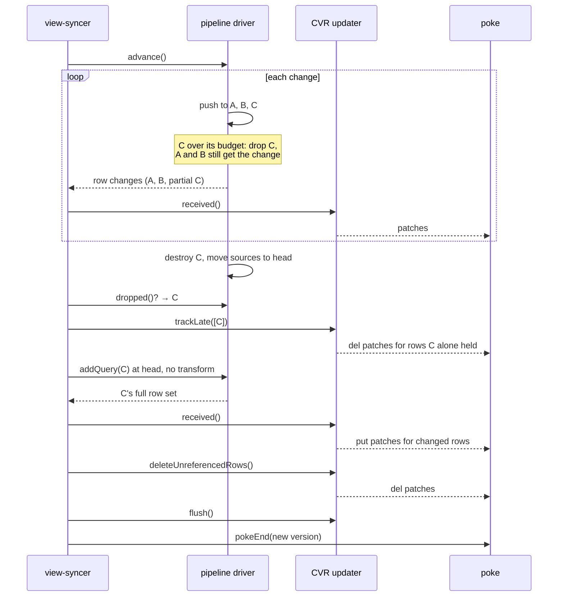

# 003: Per-pipeline reset

- **Status:** Proposed
- **Date:** 2026-09-22
- **Packages:** `zero-cache` (view-syncer, pipeline-driver, cvr)
- **Builds on:** the advancement reset budget in `pipeline-driver.ts`

## Summary

A view-syncer keeps one IVM pipeline per query for a client group. When a
transaction arrives, it pushes the changes through every pipeline. This is
called advancement. If advancement is projected to cost more than building
the pipelines again from scratch, the view-syncer gives up, throws away every
pipeline in the group, and rebuilds them all. This is called a reset.

Today the reset budget is the sum of the hydration times of every pipeline in
the group, and the reset is all-or-nothing. That is the wrong granularity. The
cost of pushing a change lives in one pipeline. The cost of rebuilding lives in
one pipeline. A cheap query with an expensive push shape can force a rebuild of
an expensive query that the change barely touched.

This design gives each pipeline its own budget. When a pipeline goes over its
budget during advancement, the view-syncer drops that pipeline, finishes
advancing the others, and rebuilds the dropped one at the new version. All of
this lands in the same poke, so clients see one consistent update. The client
and the protocol do not change.

It also fixes a latent bug in the CVR updater that is unreachable today but
becomes reachable the moment one updater mixes incremental changes with a
rebuilt query.

## Problem

### A reset storm

In a production incident on 2026-09-17, a metadata backfill updated a table in
batches of 500 rows per transaction. One small per-user query read that table
through a join with no bound on the viewer, so a single row change fanned out to
hundreds of thousands of row visits per client group. That query was cheap to
hydrate, so its push cost went over the group budget within a few hundred
milliseconds, and every client group reset.

Each reset rebuilt every pipeline in the group, including two large library
queries that took over 12 seconds of processing time to hydrate and that the
backfill did not affect in any meaningful way.

| Observation                                  | Value                    |
| -------------------------------------------- | ------------------------ |
| Resets in a 2-minute window                  | 5,732 across ~344 groups |
| One rehydration batch, process time vs wall  | 12.5 s vs 175 s          |
| Backlog on the advancement after a rehydrate | 1,000 to 6,081 changes   |

Most of that work was rebuilding pipelines that did not need rebuilding.

### Costs are per pipeline, decisions are per group

Advancing costs roughly `changes × push fan-out`, per pipeline. Hydrating costs
roughly the result size, per pipeline. The two costs are independent across
pipelines. Summing them across the group and comparing the sums throws that
information away.

### Why a reset is all-or-nothing today

Four mechanics in the driver make it impossible to drop one pipeline and keep
advancing the rest.

1. **The reset is an exception that unwinds a shared fan-out.** Every pipeline
   in a group reads a table through one shared `TableSource`. A source change
   is pushed to each connected pipeline in sequence, and only after the last
   one does the source write the change into its snapshot
   (`packages/zql/src/ivm/memory-source.ts`, `genPush` and `genPushAndWrite`).
   The budget check throws from the yield callback that runs inside a fetch.
   The loop dies in the middle. Pipelines after the current one never see the
   change and the write never happens. Nothing downstream can be trusted, so
   everything is rebuilt.

2. **Nothing attributes advancement cost to a pipeline.** The elapsed clock is
   per change, the budget is the sum of all hydration times, and the throw
   sites carry no query identity. The existing per-query timing in
   `MeasurePushOperator` is wall time and includes time yielded to other
   client groups, so it cannot drive a budget.

3. **A pipeline cannot be destroyed while a push is in flight.** Destroying a
   connection splices it out of the live array that the fan-out loop is
   iterating (`packages/zqlite/src/table-source.ts`, `connect`). The next
   connection would be skipped.

4. **All pipelines share one snapshot, and it is consistent only after the
   whole diff is applied.** The diff is ordered by table and row key, not by
   time. The previous snapshot is in a state that never existed until the last
   change is applied. A new pipeline cannot be hydrated in the middle. The
   driver enforces this: `addQuery` asserts that no advancement is in
   progress.

### Why the CVR side is the harder half

The client view record (CVR) records, for every row a client has, which
queries reference it and how many times. These are the row's `refCounts`, keyed
by query ID. The `CVRQueryDrivenUpdater` is the object that applies changes to
the CVR and produces the patches that go to the client.

The updater has two modes, and today each instance runs in exactly one of them.

- **Advancement mode.** The view-syncer never calls `trackQueries`. Each IVM
  row change becomes a delta of `+1`, `-1`, or `0` on one query's count. When
  a row's counts all reach zero, the row is deleted on the client.

- **Re-declaration mode.** Used when a query is added, re-transformed, or
  rebuilt after a reset. The view-syncer calls `trackQueries` first. Then, the
  first time any row is received, the updater strips the tracked queries' old
  counts from that row and adds the new ones. When all rows are in,
  `deleteUnreferencedRows` walks every row that referenced a tracked query
  before the update and deletes the ones no longer referenced.

The strip rule only fires the first time a row is seen (`cvr.ts`, `received`).
So the tracked set must be known before the first `received()` call for any row
a tracked query held. A partial reset cannot satisfy that: the view-syncer does
not know which pipeline it will drop until the middle of advancement, and by
then rows that the dropped query held may already have been received and poked.

Tracking the query late, with no other change, yields wrong counts. Rows the
dropped query held before and still holds end up counted twice. Rows it held
before and no longer holds keep a stale count, because `deleteUnreferencedRows`
skips rows that were already received.

### A latent bug that this design would expose

`#deleteUnreferencedRow` decides whether to skip a row by checking whether the
row's received refCounts are truthy. A row whose counts all went to zero has
received refCounts of `null`, which is a tombstone. That row is not skipped. It
is rebuilt from the refCounts as they were before the update, with only the
tracked queries stripped, and no patch is emitted.

The sequence that triggers it: a row is referenced by queries A and C; C is
tracked; an incremental change from A removes the row; `received()` writes a
tombstone and sends a delete to the client; C's rebuild does not include the
row; `deleteUnreferencedRows` then rewrites the row record as referenced by A.
The client has deleted the row and the CVR says it is still synced.

This cannot happen today because no updater mixes an untracked query's deltas
with a tracked query in one flush. It must be fixed before this design ships,
and it is a one-line fix with a clear test.

## Goals and non-goals

Goals:

- Reset only the pipelines whose advancement is over their own budget.
- Clients receive one poke that is consistent at the new version. No client
  or protocol change.
- No query-transform round trip to rebuild a dropped pipeline.
- Keep the whole-group reset as the fallback, both for other reset reasons and
  when a partial reset would rebuild most of the group anyway.
- Make partial resets observable in logs and metrics.

Non-goals:

- Changing the budget heuristics themselves (the minimum limit, the projection
  sample, the late-finish exception). They move from group to pipeline scope
  with the same shape.
- Scheduling or admission control across client groups. That is a separate
  problem.
- Partial handling of schema-change resets. Table specs are driver-wide and
  stay whole-group.
- The no-consecutive-reset guard. It is independent and can be applied per
  pipeline later.

## Design

There are three parts and a preliminary fix. The parts can ship separately
behind one flag.

### Step 0: fix the tombstone overwrite

In `#deleteUnreferencedRow`, skip the row when `#receivedRows.has(id)`, not
when the received value is truthy. `received()` has already written the row's
final record and patch, and the pruning pass must not touch it.

Add a test to `cvr.pg.test.ts` with the A-and-C scenario above. The existing
test "deleteUnreferencedRows skips row deletes already emitted by received"
covers only a row whose sole reference was the tracked query itself.

### Part A: the pipeline driver drops one pipeline and keeps going

The driver already installs a wrapper operator between each source connection
and the pipeline it feeds (`decorateSourceInput` in `#addQueryImpl`). Every push
into a pipeline passes through that wrapper, and the wrapper knows its query
ID. Everything in this part hangs off that wrapper, which we call the guard.

#### A1. Attribute advancement time to the pipeline being pushed

On push entry the guard records the advance timer's total elapsed time and
sets the driver's "current pipeline" to its query ID. On push exit, in a
`finally`, it adds the elapsed delta to that pipeline's advancement time for
this transaction and clears the current pipeline.

The advance timer already excludes time yielded to other client groups, so
this is process time. Pushes are never nested across pipelines, because the
fan-out is sequential, so one "current pipeline" slot is enough. A fetch that
one pipeline makes into another table happens inside that pipeline's push, so
it is attributed correctly.

```text
guard.push(change)
  start = advanceTimer.totalElapsed()
  driver.currentPipeline = queryID
  try
    if queryID in driver.dropped
      return                       # dropped earlier in this advancement
    yield* downstream.push(change)
  catch DropPipelineSignal for queryID
    driver.dropped.add(queryID, reason)
  finally
    pipeline.advanceMs += advanceTimer.totalElapsed() - start
    driver.currentPipeline = none
```

#### A2. Check the budget per pipeline

The three checks that exist today keep their shape and move to pipeline scope.
For the current pipeline, with `elapsed` being that pipeline's advancement
time so far and `budget` being that pipeline's own hydration time:

- **Slow current change.** The pipeline's time inside the current change
  exceeds the minimum limit and exceeds its budget.
- **Projected overrun.** After the sample, `elapsed / pos × remaining`
  exceeds `budget × 1.5`, unless the batch is at least 80% done.
- **Timeout.** Before the sample, `elapsed` exceeds the minimum limit and
  exceeds the budget, or exceeds half the budget while the batch is less than
  half done.

The checks run in two places. During a fetch, the shared yield callback checks
the current pipeline. At push exit, the guard checks its own pipeline. A
pipeline that did no work in this advancement is never over budget, so nothing
needs to iterate all pipelines at the change boundary.

Per-pipeline hydration time already exists and is already process time. The
view-syncer restarts the time-slice timer for each query it hydrates, and the
driver records the result on the pipeline.

The group-level check goes away. If every pipeline is under its own budget, the
group is under the sum.

#### A3. Drop and continue

When a check fails inside a fetch, it throws `DropPipelineSignal(queryID)`. The
signal propagates up through the pipeline's operators to the guard, which
catches only a signal for its own query, records the drop, and returns
normally. The fan-out loop in `genPush` moves on to the next connection and
writes the change to the snapshot as usual. When a check fails at push exit,
the guard records the drop without throwing.

An abandoned fetch is safe. The `TableSource` fetch generator returns its
prepared statement to the cache in a `finally`. The source's push overlay is
cleared at the end of `genPush`, as it is today.

From that point on, any push into any connection of the dropped pipeline
returns immediately. A pipeline reads several tables, so it has several
connections, and all of them consult the same dropped set.

```diff
 genPush(connections, change)
   for conn in connections
     setOverlay(change)
-    yield* conn.output.push(change)      # a throw here kills the loop
+    yield* conn.output.push(change)      # guard swallows DropPipelineSignal
     yield boundary
   setOverlay(none)
   writeChange(change)
```

The diff is on the driver's side of the connection. `genPush` itself does not
change.

#### A4. Destroy at the change boundary

The dropped pipeline is destroyed only when the driver's advance loop is back
at a change boundary, after `genPush` has returned for the current change and
its output has been streamed. At that point the driver calls `removeQuery` with
a new stop reason, `advancement-reset`. That destroys the operators and their
storage, removes the connections, prunes tables that no pipeline reads any
more, and deletes the query's row-set signature.

Pruning a table mid-advancement is fine. The snapshot diff consults the live
table map when deciding which change-log entries to skip, so later changes to
a table nobody reads are skipped, exactly as they are today for tables no
pipeline reads.

The Streamer, which turns pushed IVM changes into row changes for the CVR,
skips entries for dropped queries. That discards the dropped pipeline's partial
output for the change it was dropped in. Output it produced for earlier changes
in this advancement has already been yielded; Part B handles that.

#### A5. Report what was dropped

`advance()` gains a way to read, after the change stream is drained, which
pipelines were dropped and why. For each one the driver keeps what the
view-syncer needs to rebuild it without a transform round trip: the
transformation hash, the transformed AST, the original AST, the query name,
and the hydration time that set its budget.

#### A6. Escalate to a whole-group reset when it is cheaper

Partial reset has a fixed cost and a bounded benefit. If the dropped pipelines
account for more than half of the group's total hydration time, the driver
throws the existing `ResetPipelinesSignal` with reason `advancement-timeout`
instead, and everything proceeds exactly as today. Half is a starting point;
it is a constant, and the harness in Testing is where to tune it.

### Part B: the CVR updater learns to track a query late

#### B1. A late-track primitive

Add a method to `CVRQueryDrivenUpdater` that tracks executed queries after
`received()` has already been called. It does three things, in order.

1. **Zero out the queries in every row received so far.** For each entry in
   `#receivedRows`, delete the late-tracked queries' keys. If the merged counts
   become empty, the row is now a tombstone: write the tombstone row record and
   emit a `del` patch, deduplicated against the last patch for that row as
   `received()` already does.

2. **Add the queries to the tracked sets.** Same bookkeeping as
   `trackQueries`. With an unchanged transformation hash this bumps nothing and
   emits no query patch.

3. **Look up the rows that referenced these queries before the update.** Same
   lookup that `trackQueries` starts. This is what `deleteUnreferencedRows`
   will walk.

After this, the received map is in the state it would have been in had the
queries been tracked from the start: their old counts are gone from every row
seen so far, and rows not yet seen will have them stripped on first receipt by
the existing rule. The dropped pipeline's own partial advancement deltas are
gone too, because they were counts on the same keys.

Then the rebuilt pipeline's hydration is received in full and adds its counts
back, and `deleteUnreferencedRows` prunes the rows it no longer holds.

The correctness argument is additive. For every row, the final refCounts are
`existing − dropped queries' old counts + other queries' deltas + dropped
queries' full new counts`. Late tracking makes the middle term correct for rows
seen before the drop; the first-receipt strip makes it correct for rows seen
after; the pruning pass handles rows never received. With Step 0 in place, the
pruning pass never touches a row that `received()` already finalized.

Walkthrough for the hard row. R is referenced by A and C. During advancement A
removes R. C is dropped and rebuilt, and no longer holds R.

| Step                        | R's counts       | Patch to client |
| --------------------------- | ---------------- | --------------- |
| Before                      | `{A:1, C:1}`     |                 |
| A's remove is received      | `{C:1}`          |                 |
| Late-track C: zero out C    | `null`           | `del R`         |
| C's rebuild: R not included | `null`           |                 |
| `deleteUnreferencedRows`    | skipped (Step 0) |                 |

Without Step 0 the last row would rewrite R as `{A:1}` and the client would be
missing a row the CVR says it has.

The same row where C still holds R after the rebuild ends at `{C:1}` with a
`del` followed by a `put` in the same poke, which the client applies in order.

#### B2. Version

The advancement updater is constructed with the new replica version, which is
already a bump. Re-tracking a query with the same transformation hash bumps
nothing further. The poke started at that version stays valid. No config
version bump is needed.

#### B3. Row-set signatures

`flush` already persists the signature of every query whose live signature
differs from the stored one. The rebuilt pipeline's signature starts from zero
at `removeQuery` and is rebuilt by its hydration, so the flush stores the
right value with no change.

### Part C: the view-syncer folds the rebuild into the advancement

#### C1. The new `#advancePipelines`



In plain steps, after `#processChanges` drains the advancement stream:

1. Ask the driver what it dropped. If nothing, continue exactly as today.
2. Call the late-track method with the dropped queries. Send its patches.
3. For each dropped pipeline, call `addQuery` with the retained transformed
   AST and hash, hydration reason `advancement-reset`, and a fresh time-slice
   timer. Run its row changes through `#processChanges` with the same updater
   and the same poke handlers. This yields to other client groups as any
   hydration does.
4. Call `deleteUnreferencedRows`. Send its patches.
5. `#flushPoked`, then `pokers.end` at the updater's version, as today.

Nothing about the updater or the poke handlers finalizes when the advancement
stream drains. `trackQueries` has never been called on an advancement updater,
so the late-track method is the first tracking call. `addQuery` becomes legal
the moment the advance generator's `finally` clears the advance context.

#### C2. Fallback

If a rebuild hydration fails or exceeds the hydration timeout, the view-syncer
cancels the poke and returns a `ResetPipelinesSignal` with reason
`advancement-timeout`, which is the whole-group path that runs today. The run
loop does not change.

#### C3. Poke audience

An advancement pokes only the clients at the CVR's current version. Keep that.
Clients that are behind are caught up later from the flushed CVR, which is
consistent after the flush. This is the same rule the advancement follows
today.

#### C4. Group state

`#pipelinesHydrated` stays true throughout. The shared-retransform flag is not
touched. The run loop's reset switch is unchanged; a partial reset never
reaches it.

#### C5. Reuse of the transformed AST

The run loop today reuses previous ASTs after a reset only when the group has
no legacy client queries, because those derive from permissions. Inside one
advancement, permissions cannot have changed: a permissions change is its own
reset reason and would have thrown. So the rebuild can reuse the transformed
AST for any query type.

### Observability

- A counter `pipeline-partial-resets` with a `reason` attribute matching the
  three checks, and a histogram of the number of pipelines dropped per
  advancement.
- The existing `pipeline-resets` counter continues to count whole-group
  resets, including escalations from A6.
- One info log per drop with the same message text the whole-group reset uses
  today, plus the query name and hash.
- A new `PipelineHydrationReason`, `advancement-reset`, so the query lifecycle
  log distinguishes rebuilds from query-set syncs.

## Risks

- **refCount errors.** The failure mode is a row the client never deletes, or
  a row the client deletes that the CVR believes it has. The late-track
  primitive and Step 0 are the two places this can go wrong, and both are
  small and directly testable. The Postgres tests should assert, after the
  flush, that the set of rows with a positive count for each query equals the
  rebuilt pipeline's row set.

- **Output already poked before the drop.** Handled by same-poke delivery. The
  client applies the whole poke at `pokeEnd`, so intermediate puts for the
  dropped query are overwritten or deleted by later patches in the sequence.
  This depends on never ending the advancement poke before the rebuild is in
  it. The two-poke alternative, letting the advancement end and rebuilding
  with the existing `'missing'` sync, is rejected for this reason: clients
  would see the other queries at the new version and the dropped query's
  exclusive rows at the old one.

- **Torn CVR on crash.** The CVR is flushed once, after the rebuild, so a
  crash mid-way leaves the CVR at the previous version, exactly as an aborted
  advancement does today.

- **Pending CVR writes after an abort.** Today, when an advancement aborts
  with a reset, the poke is cancelled but the row records the updater already
  handed to the store are not discarded until the next flush. The full
  rehydration re-writes almost every affected row, which masks it. This design
  does not make it worse, because the updater is not abandoned, but it is
  worth its own fix.

- **Escalation threshold.** Too low and partial reset rarely fires. Too high
  and a group that is mostly over budget pays for both paths. Start at half
  and measure.

- **Multiple drops.** Several pipelines can be dropped in one advancement.
  Every step above is a loop over the dropped set, and the late-track method
  takes a list.

## Testing

Driver unit tests, in the runaway-push harness:

- Two queries on the same table. One has an unbounded push shape and a small
  hydration time; the other is cheap to push. The expensive one is dropped,
  the cheap one advances to the end, and the dropped set names the right query
  with the right reason.
- The Streamer emits nothing for a dropped query after the drop.
- The dropped pipeline's connections are gone and its table is pruned when it
  was the only reader.
- Yields still happen while a drop is pending.
- The escalation rule throws the whole-group signal when the dropped set is
  most of the group.
- `addQuery` for the dropped query succeeds after the stream is drained and
  reads from the new head.

CVR tests, in `cvr.pg.test.ts`:

- The Step 0 regression: a tombstoned row is not resurrected by pruning.
- Late-track scenarios for a row referenced by A and C: A removes it and C
  still holds it; A removes it and C drops it; A adds it and C holds it; C
  alone held it and drops it. Each asserts the final refCounts and the patch
  sequence.
- The dropped query's partial advancement deltas are cancelled.

View-syncer tests, in `view-syncer.pg.test.ts`:

- A client at the current version receives one poke whose final state matches
  a full rehydration of every query at the new version.
- A client behind the CVR is caught up correctly afterwards.
- A failed rebuild falls back to the whole-group reset and the client sees a
  cancelled poke followed by the normal reset flow.
- The counters and the lifecycle log fire as described.

Measurement: the replica advance-perf harness in `zql-benchmarks` can replay
the incident's shape with many client groups. Compare whole-group reset against
partial reset on total processing time per transaction and on the time until
the median group is current.

## Rollout

One flag, `ZERO_PARTIAL_PIPELINE_RESET`, default off. Off means the driver's
checks stay at group scope and throw as they do today; the guard still records
per-pipeline time, which is useful on its own for the inspector. Ship Step 0
first and independently.

## Future work

- **Truncation.** A truncated table only affects pipelines that read it. That
  is the same drop-and-rebuild with a different trigger.
- **Scalar subqueries.** A companion pipeline that detects a changed scalar
  value throws a whole-group reset today. It knows its owning query and could
  drop just that pipeline.
- **Per-pipeline hysteresis.** A pipeline rebuilt in one advancement should
  not be dropped again in the next until it has completed one advancement.
  This is the per-pipeline form of the no-consecutive-reset guard.
- **Budget in the rebuild's currency.** The budget today is hydration process
  time. A rebuild also costs a CVR walk over the query's rows and the patches
  for changed rows. Pricing that in would sharpen the decision.

## Open questions

- Should the escalation rule also consider the count of dropped pipelines, or
  only their hydration time?
- Should a rebuild that itself blows the hydration timeout fall back to a
  whole-group reset, or drop that query with an error to the client the way a
  query-set sync does?
