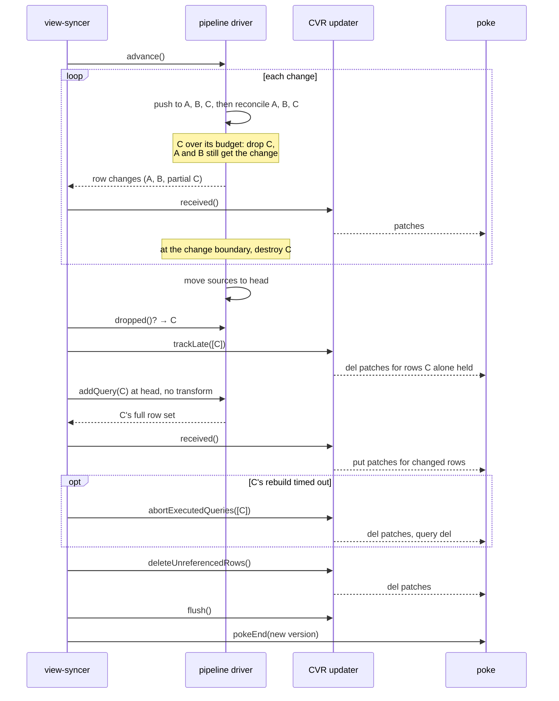

# 003: Per-pipeline reset

- **Status:** Proposed
- **Date:** 2026-09-22
- **Revised:** 2026-09-23, after review (two-phase push, time attribution,
  group backstop, abort in place)
- **Packages:** `zero-cache` (view-syncer, pipeline-driver, cvr)
- **Builds on:** the advancement reset budget in `pipeline-driver.ts`

## Summary

A view-syncer keeps one IVM pipeline per query for a client group. When a
transaction arrives, it pushes the changes through every pipeline. This is
called advancement. If advancement is projected to cost more than building
the pipelines again from scratch, the view-syncer gives up, throws away every
pipeline in the group, and rebuilds them all. This is called a reset.

Today the reset budget is the sum of the hydration times of every pipeline in
the group, and the reset is all-or-nothing. That is the wrong granularity. The
cost of pushing a change lives in one pipeline. The cost of rebuilding lives in
one pipeline. A cheap query with an expensive push shape can force a rebuild of
an expensive query that the change barely touched.

This design gives each pipeline its own budget. When a pipeline goes over its
budget during advancement, the view-syncer drops that pipeline, finishes
advancing the others, and rebuilds the dropped one at the new version. All of
this lands in the same poke, so clients see one consistent update. The client
and the protocol do not change. The group budget stays as a backstop. If a
rebuild itself times out, the view-syncer aborts that query in the same poke,
as a query-set sync does today.

It depends on two small fixes in the CVR layer that ship first. One closes a
latent bug in the updater's pruning pass that is unreachable today but becomes
reachable the moment one updater mixes incremental changes with a rebuilt
query. The other lets the store discard the writes of an updater that is
abandoned mid-way, which today's reset path also needs.

## Problem

### A reset storm

In a production incident on 2026-09-17, a metadata backfill updated a table in
batches of 500 rows per transaction. One small per-user query read that table
through a join with no bound on the viewer, so a single row change fanned out to
hundreds of thousands of row visits per client group. That query was cheap to
hydrate, so its push cost went over the group budget within a few hundred
milliseconds, and every client group reset.

Each reset rebuilt every pipeline in the group, including two large library
queries that took over 12 seconds of processing time to hydrate and that the
backfill did not affect in any meaningful way.

| Observation                                  | Value                    |
| -------------------------------------------- | ------------------------ |
| Resets in a 2-minute window                  | 5,732 across ~344 groups |
| One rehydration batch, process time vs wall  | 12.5 s vs 175 s          |
| Backlog on the advancement after a rehydrate | 1,000 to 6,081 changes   |

Most of that work was rebuilding pipelines that did not need rebuilding.

### Costs are per pipeline, decisions are per group

Advancing costs roughly `changes × push fan-out`, per pipeline. Hydrating costs
roughly the result size, per pipeline. The two costs are independent across
pipelines. Summing them across the group and comparing the sums throws that
information away.

### Why a reset is all-or-nothing today

Four mechanics in the driver make it impossible to drop one pipeline and keep
advancing the rest.

1. **The reset is an exception that unwinds a shared fan-out.** Every pipeline
   in a group reads a table through one shared `TableSource`. A source change
   is pushed in two phases (`packages/zql/src/ivm/memory-source.ts`,
   `genPush`). Phase 1 pushes the change to each connected pipeline in
   sequence. Phase 2 calls `reconcile` on each connection, and Take refills
   its window there. Only after both phases does the source write the change
   into its snapshot (`genPushAndWrite`). The budget check throws from the
   yield callback that runs inside a fetch. The loop dies in the middle.
   Pipelines after the current one never see the change, phase 2 does not
   run, and the write never happens. Nothing downstream can be trusted, so
   everything is rebuilt.

2. **Nothing attributes advancement cost to a pipeline.** The elapsed clock is
   per change, the budget is the sum of all hydration times, and the throw
   sites carry no query identity. The existing per-query timing in
   `MeasurePushOperator` is wall time and includes time yielded to other
   client groups, so it cannot drive a budget.

3. **A pipeline cannot be destroyed while a push is in flight.** Destroying a
   connection splices it out of the live array that the fan-out loop is
   iterating (`packages/zqlite/src/table-source.ts`, `connect`). The next
   connection would be skipped.

4. **All pipelines share one snapshot, and it is consistent only after the
   whole diff is applied.** The change log keeps one entry per row, for the
   row's latest change, and the diff replays those entries in commit order
   (`stateVersion`, `pos`). A row that changed early and again late appears
   once, at its late position, with its final value. So until the last change
   is applied, the previous snapshot is in a state that never existed. A new
   pipeline cannot be hydrated in the middle. The driver enforces this:
   `addQuery` asserts that no advancement is in progress.

### Why the CVR side is the harder half

The client view record (CVR) records, for every row a client has, which
queries reference it and how many times. These are the row's `refCounts`, keyed
by query ID. The `CVRQueryDrivenUpdater` is the object that applies changes to
the CVR and produces the patches that go to the client.

The updater has two modes, and today each instance runs in exactly one of them.

- **Advancement mode.** The view-syncer never calls `trackQueries`. Each IVM
  row change becomes a delta of `+1`, `-1`, or `0` on one query's count. When
  a row's counts all reach zero, the row is deleted on the client.

- **Re-declaration mode.** Used when a query is added, re-transformed, or
  rebuilt after a reset. The view-syncer calls `trackQueries` first. Then, the
  first time any row is received, the updater strips the tracked queries' old
  counts from that row and adds the new ones. When all rows are in,
  `deleteUnreferencedRows` walks every row that referenced a tracked query
  before the update and deletes the ones no longer referenced.

The strip rule only fires the first time a row is seen (`cvr.ts`, `received`).
So the tracked set must be known before the first `received()` call for any row
a tracked query held. A partial reset cannot satisfy that: the view-syncer does
not know which pipeline it will drop until the middle of advancement, and by
then rows that the dropped query held may already have been received and poked.

Tracking the query late, with no other change, yields wrong counts. Rows the
dropped query held before and still holds end up counted twice. Rows it held
before and no longer holds keep a stale count, because `deleteUnreferencedRows`
skips rows that were already received.

### A latent bug that this design would expose

`#deleteUnreferencedRow` decides whether to skip a row by checking whether the
row's received refCounts are truthy. A row whose counts all went to zero has
received refCounts of `null`, which is a tombstone. That row is not skipped. It
is rebuilt from the refCounts as they were before the update, with only the
tracked queries stripped, and no patch is emitted.

The sequence that triggers it: a row is referenced by queries A and C; C is
tracked; an incremental change from A removes the row; `received()` writes a
tombstone and sends a delete to the client; C's rebuild does not include the
row; `deleteUnreferencedRows` then rewrites the row record as referenced by A.
The client has deleted the row and the CVR says it is still synced.

This cannot happen today because no updater mixes an untracked query's deltas
with a tracked query in one flush. It must be fixed before this design ships,
and it is a one-line fix with a clear test.

## Goals and non-goals

Goals:

- Reset only the pipelines whose advancement is over their own budget.
- Clients receive one poke that is consistent at the new version. No client
  or protocol change.
- No query-transform round trip to rebuild a dropped pipeline.
- Keep the whole-group reset as the fallback: for other reset reasons, when a
  partial reset would rebuild most of the group anyway, and when the group as
  a whole goes over its budget.
- Make partial resets observable in logs and metrics.

Non-goals:

- Changing the budget heuristics themselves (the minimum limit, the projection
  sample, the late-finish exception). They move from group to pipeline scope
  with the same shape.
- Scheduling or admission control across client groups. That is a separate
  problem.
- Partial handling of schema-change resets. Table specs are driver-wide and
  stay whole-group.
- The no-consecutive-reset guard. It is independent and can be applied per
  pipeline later.

## Design

There are three parts and a preliminary fix. The parts can ship separately
behind one flag.

### Step 0: two prerequisite fixes in the CVR layer

Both ship first, independently, and are correct on their own.

#### 0a. Fix the tombstone overwrite

In `#deleteUnreferencedRow`, skip the row when `#receivedRows.has(id)`, not
when the received value is truthy. `received()` has already written the row's
final record and patch, and the pruning pass must not touch it.

Add a test to `cvr.pg.test.ts` with the A-and-C scenario above. The existing
test "deleteUnreferencedRows skips row deletes already emitted by received"
covers only a row whose sole reference was the tracked query itself.

#### 0b. Discard an abandoned updater's pending writes

`CVRStore` queues every write an updater makes and clears the queues only in
the `finally` of `flush`. There is no way to throw the queue away. When an
advancement aborts with a reset today, the view-syncer cancels the poke but
leaves the row records the updater already queued, and the next flush writes
them.

The full rehydration that follows mostly masks this, because it re-receives
almost every affected row. It does not mask a row that was not in the CVR
before, that the aborted work added, and that no query re-declares afterwards.
Pruning never visits such a row, because pruning walks the committed cache.
Its pending put is flushed with a positive count although the client never
received it, since the poke that carried it was cancelled.

Add `discardPending()` to `CVRStore`. It clears exactly the state that
`flush`'s `finally` clears: the row record updates, query updates, partial
query updates, desire updates, the instance write, the extra write set, and
the forced-update set. It does not touch the row cache, which only learns of
writes at flush time. Call it in the reset catch of `#advancePipelines`. That
catch handles today's resets and, with this design, every whole-group reset
that follows a drop (C2).

It is safe to discard everything because the store is only written under the
view-syncer lock by the updater in progress. The one write outside the lock,
the TTL clock, is a direct SQL update that does not use the queue.

Test it with a row absent from the original CVR, added by an aborted updater,
whose query is then rejected by the circuit breaker during the hydration
after the reset. The pending put must not reach the CVR.

### Part A: the pipeline driver drops one pipeline and keeps going

The driver already installs a wrapper operator between each source connection
and the pipeline it feeds (`decorateSourceInput` in `#addQueryImpl`). Every push
and every reconcile into a pipeline passes through that wrapper, and the
wrapper knows its query ID. Everything in this part hangs off a new wrapper
around that one, which we call the guard. The guard sits next to the pipeline,
so it catches a signal before `MeasurePushOperator` and
`QueryFailureLoggingOperator` see it.

Scalar companion pipelines are the one exception today.
`#resolveScalarSubqueries` builds them with a pass-through
`decorateSourceInput`, so their connections have no wrapper. This design wraps
them with the same guard, under the owning query's ID (A3).

#### A1. Attribute advancement time to the pipeline doing the work

A pipeline does work in three places during advancement, and all three must be
attributed.

- **Push (phase 1).** The operators run as the change travels up the
  pipeline, and they fetch along the way. This happens inside the guard's
  `push`.
- **Reconcile (phase 2).** After the change is pushed to every connection,
  `genPush` calls `reconcile` on every connection. Take refills its window
  here, with fetches. This happens inside the guard's `reconcile`.
- **Streaming.** A pipeline's output is a `Change` whose node carries its
  relationships as lazy functions. `Join` builds them that way, and the child
  rows are not fetched until someone iterates them. The driver's `#push`
  collects each pipeline's output in a `Streamer`. It drains the `Streamer`
  after each connection's push or reconcile returns, and also at every yield
  while a push is suspended. Draining is what fetches the related rows. For a
  parent change with many related rows, most of the work happens here.

The driver keeps one "current pipeline" slot and one stopwatch. Each time the
slot changes, the stopwatch charges the time since the last change to the
pipeline that held the slot. Three sites set the slot, and each one restores
the previous value when it exits:

- the guard's `push`,
- the guard's `reconcile`,
- the driver's `#push`, around each `Streamer` entry it drains. The `Streamer`
  already records the query ID with every entry.

Two rules keep the charge correct.

- **Charge each moment once.** A drain at a yield runs while the guard's push
  is suspended. If the guard measured from its entry to its exit, and the
  drain measured its own window, the drain's time would be counted twice.
  That is the lazy-relationship case, where most of the work is. Charging on
  slot changes counts each moment once.
- **Charge only the driver's own time.** Between two pulls of the advancement
  stream, the view-syncer runs `#processChanges`. Every 10,000 rows it runs
  `received()` and `addPatch` for a batch that holds rows from many
  pipelines. That time would otherwise land on whichever pipeline filled the
  batch. The stopwatch stops when the driver yields out and starts again when
  it resumes, so this time goes to no pipeline. The group backstop (A2) still
  counts it.

The stopwatch reads the advance timer's total elapsed time, which already
excludes time yielded to other client groups. Time when no pipeline is
current is charged to no pipeline. This includes diff reads, writes to the
previous snapshot, and the existence checks in `genPush`. The stopwatch also
keeps each pipeline's time in the current change, for the slow-change check.
`#advance` clears those per-change totals at each change boundary.

Pushes are never nested across pipelines, because the fan-out is sequential.
A `Streamer` entry drained while a push is suspended belongs to the same
pipeline as that push. So one slot is enough.

```text
driver.charge()
  now = advanceTimer.totalElapsed()
  if current != none
    pipelines[current].advanceMs += now - mark
    pipelines[current].changeMs += now - mark
  mark = now

driver.setCurrent(queryID)                # returns the previous value
  charge()
  previous = current
  current = queryID
  return previous

driver.advanceStream()                    # wraps what advance() returns
  for x in #advance(...)
    charge()
    yield x                               # the view-syncer runs here
    mark = advanceTimer.totalElapsed()    # its time is not charged

guard.push(change)                        # guard.reconcile() is the same
  if queryID in driver.dropped
    return
  previous = driver.setCurrent(queryID)
  it = downstream.push(change)
  try
    loop
      if queryID in driver.dropped        # dropped while suspended
        it.return()                       # runs the operators' finally blocks
        return
      r = it.next()
      if r.done
        break
      yield r.value
    driver.checkAtExit(queryID)           # records a drop; does not throw
  catch DropPipelineSignal for queryID
    driver.drop(queryID, reason)
  finally
    driver.setCurrent(previous)

driver.#push(source, change)
  for boundary in source.genPush(change)  # phase 1, then phase 2
    if boundary is 'yield'
      yield 'yield'
    for [queryID, changes] in streamer.entries()
      if queryID in driver.dropped
        continue                          # discard partial output
      previous = driver.setCurrent(queryID)
      try
        yield* stream(queryID, changes)   # lazily fetches related rows
        driver.checkAtExit(queryID)
      catch DropPipelineSignal for queryID
        driver.drop(queryID, reason)
      finally
        driver.setCurrent(previous)
```

The guard checks the dropped set before it resumes its downstream, not after.
Otherwise a dropped pipeline would run one more step of work.

#### A2. Check the budget per pipeline

**The budget.** Each pipeline's budget is its own hydration time, measured
the same way as its advancement time: the driver's own time, without the
view-syncer's time between pulls. The driver records this IVM hydration time
as a new field on the pipeline, next to `hydrationTimeMs`. The existing field
cannot be the budget.
It includes CVR batch time when `#syncQueryPipelineSet` hydrated the query,
but not when `#hydrateUnchangedQueries` did, because that path does not diff
rows. So the same query would get a different budget depending on how it was
last hydrated. `hydrationTimeMs` keeps its other uses: the group budget and
the drain timer.

**Progress.** Progress is also per pipeline. `numChanges_p` is the number of
changes in the diff to tables that the pipeline reads. `pos_p` is how many of
those changes the driver has processed. The driver records the tables a
pipeline reads when it builds the pipeline, from the builder's `getSource`
calls. The snapshotter replaces its count query with a count per table, and
the total is the sum.

Progress must be per pipeline because the diff is in commit order, not table
order (mechanic 4). Take a backlog of several transactions in which the
pipeline's table changed only in the first one. With batch-wide progress, the
projection would assume the pipeline keeps working for the whole batch.

**The checks.** The three checks that exist today keep their shape and move to
pipeline scope. For the current pipeline, `elapsed` is its advancement time so
far and `budget` is its hydration time.

- **Slow current change.** The pipeline's time inside the current change
  exceeds the minimum limit and exceeds its budget.
- **Projected overrun.** After the sample, `elapsed / pos_p × numChanges_p`
  exceeds `budget × 1.5`, unless the pipeline is at least 80% through its
  changes.
- **Timeout.** Before the sample, `elapsed` exceeds the minimum limit and
  exceeds the budget, or exceeds half the budget while the pipeline is less
  than half through its changes.

The checks run in three places. During a fetch, the shared yield callback
checks the current pipeline, whichever site set it. When the guard's push or
reconcile exits, the guard checks its own pipeline. After draining a
`Streamer` entry, the driver checks that entry's pipeline. A pipeline that did
no work in this advancement is never over budget, so nothing needs to iterate
all pipelines at the change boundary.

**The group backstop.** The group-level check stays, unchanged. When it
fails, the driver throws the whole-group `ResetPipelinesSignal` as it does
today. The per-pipeline checks do not bound the group by themselves, for two
reasons.

- **The minimum limit applies to each pipeline.** Twenty pipelines with 5 ms
  of hydration each have a group budget of 100 ms. Each pipeline gets the
  50 ms minimum, so together they could spend 1 s. If all twenty are slow,
  escalation (A6) fires only after 11 drops, at about 550 ms.
- **Some time belongs to no pipeline.** Diff reads, writes to the previous
  snapshot and the view-syncer's batches are charged to no pipeline (A1).

In the incident's shape, the per-pipeline check fires long before the group
check. The small query's budget is the 50 ms minimum. The group's budget is
more than 12 s.

#### A3. Drop and continue

`DropPipelineSignal` extends `ResetPipelinesSignal`, with reason
`advancement-timeout` and the query ID. Two things follow. The failure logging
in `QueryFailureLoggingOperator`, `Streamer.stream()` and `logQueryFailure`
already skips reset signals, so a drop is not logged as a query failure. And a
drop signal that escapes every catch site by mistake becomes a whole-group
reset, not a crash.

When a check fails inside a fetch, it throws `DropPipelineSignal` for the
current pipeline. Where it is caught depends on which site is running.

- **Raised during a push or a reconcile.** The signal propagates up through
  the pipeline's operators to the guard, which catches only a signal for its
  own query, records the drop, and returns normally. `genPush` moves on to the
  next connection, runs phase 2, and writes the change to the snapshot as
  usual. When a check fails at exit, the guard records the drop without
  throwing.

- **Raised during streaming.** The signal propagates out of the lazy
  relationship stream to the driver's `#push`, which catches it around the
  `Streamer` entry it was draining, records the drop, and discards the rest of
  that entry. `Streamer.stream()` is split so that the driver can iterate the
  entries and catch around each one. The guard is not on the stack at this
  point, so it cannot be the catch site. If the entry was being drained at a
  yield point while the same pipeline's push was suspended, that push is
  still live inside `genPush`. The guard checks the dropped set before it
  resumes its downstream push, so when the push resumes, the guard returns at
  once. Returning from the guard's generator runs the `finally` blocks of the
  suspended operators and fetches below it, and `genPush` moves on to the
  next connection.

An abandoned fetch is safe. The `TableSource` fetch generator returns its
prepared statement to the cache in a `finally`. The source's push overlay is
cleared at the end of `genPush`, as it is today.

From that point on, any push or reconcile into any connection of the dropped
pipeline returns immediately, and the `Streamer` discards any output still
queued for it.

Skipping reconcile is needed for correctness, not only to save time. A
pipeline dropped in phase 1 holds half-applied operator state. Take's refill
asserts on that state (`take.ts`, `assert(deficit > 0)`). A failed assertion
is a plain error, not a reset signal, so it would stop the view-syncer.

A pipeline reads several tables, so it has several connections, and all of
them consult the same dropped set. A pipeline can also have more than one
connection to the same table, for example in a self-join. One drop covers all
of them. The guards on the pipeline's scalar companions use the owner's query
ID, so a dropped pipeline's companions get no pushes, and their time is
charged to the owner.

```diff
 genPush(connections, change)
   setOverlay(change)
   for conn in connections                # phase 1
-    yield* conn.output.push(change)      # a throw here kills the loop
+    yield* conn.output.push(change)      # guard swallows DropPipelineSignal
     yield boundary
   for conn in connections                # phase 2: Take refills
-    yield* conn.output.reconcile()       # a throw here kills the loop
+    yield* conn.output.reconcile()       # guard skips dropped pipelines
     yield boundary
   setOverlay(none)
 writeChange(change)                      # genPushAndWrite
```

The diff is on the driver's side of the connection. `genPush` itself does not
change.

#### A4. Destroy at the change boundary

The dropped pipeline is destroyed only when the driver's advance loop is back
at a change boundary, after `genPush` has returned for the current change and
its output has been streamed. A split edit (a remove, then an add) is one
change, so the boundary comes after both halves. At that point the driver
calls `removeQuery` with a new stop reason, `advancement-reset`. That destroys
the operators and their storage, removes the connections, prunes tables that
no pipeline reads any more, and deletes the query's row-set signature.

Pruning a table mid-advancement is fine. The snapshot diff consults the live
table map when deciding which change-log entries to skip, so later changes to
a table nobody reads are skipped, exactly as they are today for tables no
pipeline reads.

The Streamer, which turns pushed IVM changes into row changes for the CVR,
skips entries for dropped queries, including the remainder of the entry it was
draining when the drop was raised. That discards the dropped pipeline's partial
output for the change it was dropped in. Output it produced for earlier changes
in this advancement has already been yielded; Part B handles that.

#### A5. Report what was dropped

`advance()` gains a way to read, after the change stream is drained, which
pipelines were dropped and why. For each one the driver keeps what the
view-syncer needs to rebuild it without a transform round trip: the
transformation hash, the transformed AST, the original AST, the query name,
and the hydration time that set its budget.

The driver keeps this dropped set until the next `advance()` or `reset()`. A
whole-group reset after a drop needs it too, so that it does not transform the
dropped queries again (C4).

#### A6. Escalate to a whole-group reset when it is cheaper

Partial reset has a fixed cost and a bounded benefit. If the dropped pipelines
account for more than half of the group's total hydration time, the driver
throws the existing `ResetPipelinesSignal` with reason `advancement-timeout`
instead, and everything proceeds exactly as today. Half is a starting point;
it is a constant, and the harness in Testing is where to tune it.

Only hydration time counts, not the number of drops. The number of drops
matters mostly through the minimum limit that each drop can spend, and the
group backstop (A2) bounds that.

### Part B: the CVR updater learns to track a query late

#### B1. A late-track primitive

Add a method to `CVRQueryDrivenUpdater` that tracks executed queries after
`received()` has already been called. It is made of two pieces that already
exist, and it adds no new way to write a row record.

1. **Track the queries.** This is the body of `trackQueries`: `#trackExecuted`
   for each query, then the lookup of the committed rows that reference the
   queries. That lookup is what `deleteUnreferencedRows` will walk.
   `trackQueries` has never been called on an advancement updater, so its
   "only once" assertion holds. With an unchanged transformation hash,
   `#trackExecuted` bumps nothing and emits no query patch (B2).

2. **Unreference the queries in every row received so far.** This is the loop
   at the start of `abortExecutedQueries`. For each row in `#receivedRows`
   that has a count for one of the queries, it builds a negative delta equal
   to that count and sends the batch through `received()`. A row whose counts
   all reach zero becomes a tombstone and gets a `del` patch. A row that other
   queries still reference keeps its patch version, because the delta carries
   the row's current version (`lastPatch ?? existing`). Extract the loop into
   a private method that both callers use.

The order of the two steps does not matter. `received()` strips tracked
queries only on a row's first receipt, and every row in step 2 has already
been received.

After this, the received map is in the state it would have been in had the
queries been tracked from the start: their old counts are gone from every row
seen so far, and rows not yet seen will have them stripped on first receipt by
the existing rule. The dropped pipeline's own partial advancement deltas are
gone too, because they were counts on the same keys.

Then the rebuilt pipeline's hydration is received in full and adds its counts
back, and `deleteUnreferencedRows` prunes the rows it no longer holds. The
rebuild's rows must go through their own `#processChanges` call, after the
late-track. `#processChanges` merges the deltas for a row within a batch, so
sharing a call with the advancement would merge the dropped query's partial
deltas with its rebuilt counts before the late-track could remove them.

The correctness argument is additive. For every row, the final refCounts are
`existing − dropped queries' old counts + other queries' deltas + dropped
queries' full new counts`. Late tracking makes the middle term correct for rows
seen before the drop; the first-receipt strip makes it correct for rows seen
after; the pruning pass handles rows never received. With Step 0a in place, the
pruning pass never touches a row that `received()` already finalized.

Walkthrough for the hard row. R is referenced by A and C. During advancement A
removes R. C is dropped and rebuilt, and no longer holds R.

| Step                        | R's counts        | Patch to client |
| --------------------------- | ----------------- | --------------- |
| Before                      | `{A:1, C:1}`      |                 |
| A's remove is received      | `{C:1}`           |                 |
| Late-track C: unreference C | `null`            | `del R`         |
| C's rebuild: R not included | `null`            |                 |
| `deleteUnreferencedRows`    | skipped (Step 0a) |                 |

Without Step 0a the last row would rewrite R as `{A:1}` and the client would be
missing a row the CVR says it has.

The same row where C still holds R after the rebuild ends at `{C:1}` with a
`del` followed by a `put` in the same poke, which the client applies in order.

#### B2. Version

The advancement updater is constructed with the new replica version, which is
already a bump. Re-tracking a query with the same transformation hash bumps
nothing further. The poke started at that version stays valid. No config
version bump is needed.

This depends on the kept hash being equal to the CVR's hash for the query. A
different hash would make `#trackExecuted` bump the version after the poke
started with its final cookie. The two should always be equal, because a
re-transform replaces the pipeline and updates the CVR in the same updater.
The view-syncer checks anyway. On a mismatch it cancels the poke and falls
back to the whole-group reset.

#### B3. Row-set signatures

`flush` already persists the signature of every query whose live signature
differs from the stored one. The rebuilt pipeline's signature starts from zero
at `removeQuery` and is rebuilt by its hydration, so the flush stores the
right value with no change.

### Part C: the view-syncer folds the rebuild into the advancement

#### C1. The new `#advancePipelines`



In plain steps, after `#processChanges` drains the advancement stream:

1. Ask the driver what it dropped. If nothing, continue exactly as today.
2. Check that each dropped query's kept hash equals the CVR's hash (B2).
3. Call the late-track method with the dropped queries. Send its patches.
4. For each dropped pipeline, call `addQuery` with the retained original AST
   (see C5), the retained hash, hydration reason `advancement-reset`, and a
   fresh time-slice timer. Check the hydration circuit breaker at each yield,
   as `#syncQueryPipelineSet` does. Run the row changes through a new
   `#processChanges` call (B1) with the same updater and the same poke
   handlers. This yields to other client groups as any hydration does.
5. Abort the rebuilds that did not finish (C2). Send their patches.
6. Call `deleteUnreferencedRows`. Send its patches.
7. `#flushPoked`, then `pokers.end` at the updater's version, as today.

Nothing about the updater or the poke handlers finalizes when the advancement
stream drains. `trackQueries` has never been called on an advancement updater,
so the late-track method is the first tracking call. `addQuery` becomes legal
the moment the advance generator's `finally` clears the advance context.

#### C2. When a rebuild does not finish

A rebuild can exceed the hydration timeout, or its transformation's circuit
breaker can already be open. In both cases the view-syncer aborts that query
inside the same updater and poke. This is the path `#syncQueryPipelineSet`
uses today:

- `abortExecutedQueries` unreferences the rows received for the query and
  removes the query from the CVR,
- the driver removes the pipeline,
- `#sendHydrationTimeoutErrors` sends the query error to every client that
  wants the query.

The other queries still advance in the same poke. `deleteUnreferencedRows`
then removes the query's references from the rows it held before this update.
Internal queries are never aborted, as today.

A whole-group reset would end in the same place, but at a much higher cost.
The breaker is open for the query's transformation, so the reset's hydration
rejects the query. But the reset rebuilds every other pipeline first.

An error thrown by a rebuild propagates as an error thrown during advancement
does today.

A whole-group reset still happens for the other reasons: escalation (A6), the
group backstop (A2), a hash mismatch (B2), and any other reset signal later in
the same advancement. All of these go through the reset catch of
`#advancePipelines`, which cancels the poke and calls `discardPending()`.

The discard is not optional. By this point the updater has queued row records
for the whole advancement. A dropped pipeline's partial output can queue a put
for a row that was not in the CVR before. If the whole-group hydration that
follows rejects that query, for example because its timeout tripped the
circuit breaker, no query re-declares the row, pruning never visits it, and
its pending put would be flushed although the client never received it. Step
0b exists for this path.

#### C3. Poke audience

An advancement pokes only the clients at the CVR's current version. Keep that.
Clients that are behind are caught up later from the flushed CVR, which is
consistent after the flush. This is the same rule the advancement follows
today.

#### C4. Group state

`#pipelinesHydrated` stays true throughout. The shared-retransform flag is not
touched. A partial reset never reaches the run loop's reset switch.

A whole-group reset after a drop does reach it. The run loop builds
`previousQueries` from `#pipelines.queries()`, which no longer holds the
dropped pipelines, because they were destroyed at their change boundaries.
Without a change, the reset would send the dropped queries through a
transform round trip. So the run loop merges the driver's dropped set (A5)
into `previousQueries` before it calls `reset()`. The rule for reuse does not
change: previous ASTs are reused only when the group has no legacy client
queries.

#### C5. Reuse of the retained AST

The driver keeps two ASTs per pipeline. `originalAst` is the query as the
view-syncer handed it over. `transformedAst` is what the driver actually built:
`#resolveScalarSubqueries` has already replaced every scalar subquery with its
literal value, and the companion pipelines that watch those values for changes
are created as a side effect of that resolution.

The rebuild must start from `originalAst`, falling back to `transformedAst`
only when there is no original. Rebuilding from the resolved AST would create
no companions, so a later change to a scalar's source row would never trigger
a reset, and the pipeline would keep serving the value the scalar had when the
dropped pipeline was built. This is the same choice the full-reset reuse path
makes today with `previous.originalAst ?? previous.transformedAst`.

Two timing cases follow from the drop-and-rebuild sequence. A scalar source
change that lands later in the same advancement is observed by nobody. Before
the change boundary, the companions' guards return at once (A3); after it,
the companions are destroyed. The rebuild then resolves the scalar at the new
head, which includes that change, so the result is correct. A scalar source
change in the next transaction is seen by the rebuilt pipeline's fresh
companions and resets as today.

The run loop today reuses previous ASTs after a reset only when the group has
no legacy client queries, because those derive from permissions. Inside one
advancement, permissions cannot have changed: a permissions change is its own
reset reason and would have thrown. So the rebuild can reuse the retained AST
for any query type.

### Observability

- A counter `pipeline-partial-resets` with a `reason` attribute matching the
  three checks, and a histogram of the number of pipelines dropped per
  advancement.
- The existing `pipeline-resets` counter continues to count whole-group
  resets, including escalations from A6 and resets from the group backstop.
- A rebuild aborted by C2 is counted by the existing query-evictions counter,
  with reason `hydration-timeout` or `hydration-circuit-breaker`.
- One info log per drop with the same message text the whole-group reset uses
  today, plus the query name and hash, the pipeline's advancement time and
  budget, and its progress (`pos_p` of `numChanges_p`).
- A new `PipelineHydrationReason`, `advancement-reset`, so the query lifecycle
  log distinguishes rebuilds from query-set syncs.

## Risks

- **refCount errors.** The failure mode is a row the client never deletes, or
  a row the client deletes that the CVR believes it has. The late-track
  primitive and Step 0a are the two places this can go wrong. Both are small
  and directly testable, and the late-track primitive is made of code that
  already runs for query-set syncs and hydration timeouts. The Postgres tests
  should assert, after the flush, that the set of rows with a positive count
  for each query equals the rebuilt pipeline's row set.

- **Output already poked before the drop.** Handled by same-poke delivery. The
  client applies the whole poke at `pokeEnd`, so intermediate puts for the
  dropped query are overwritten or deleted by later patches in the sequence.
  This depends on never ending the advancement poke before the rebuild is in
  it. The two-poke alternative, letting the advancement end and rebuilding
  with the existing `'missing'` sync, is rejected for this reason: clients
  would see the other queries at the new version and the dropped query's
  exclusive rows at the old one.

- **Torn CVR on crash.** The CVR is flushed once, after the rebuild, so a
  crash mid-way leaves the CVR at the previous version, exactly as an aborted
  advancement does today.

- **Pending CVR writes after an abort.** A whole-group reset after a drop
  (C2) abandons an updater that has queued writes for the whole advancement,
  including the dropped pipelines' partial output. Without Step 0b those
  writes reach the next flush even though their poke was cancelled, and a row
  the client never received can be recorded as synced. Step 0b is therefore a
  prerequisite, not a follow-up, and it also closes the narrower pre-existing
  version of the same hole in today's reset path.

- **Phase 2 on a dropped pipeline.** A pipeline dropped in phase 1 holds
  half-applied operator state. If its reconcile ran, Take could fail an
  assertion and stop the view-syncer (A3). The guard skips reconcile for
  dropped pipelines, and the driver tests cover a drop in each phase.

- **Attribution noise.** A wrong drop costs one rebuild of that pipeline,
  which its own budget bounds. So random noise in the attribution costs
  little. Systematic errors cost more, because they repeat every advancement.
  A1's two rules remove the two known ones: counting drains twice, and
  charging the view-syncer's batches.

- **Connections removed during a diff.** Destroying a pipeline's connections
  in the middle of an advancement changes which changes `TableSource`'s
  skip-unobservable path drops, for the rest of the diff. For a table with
  more than one unique key, the previous values the diff reads depend on
  earlier writes, and the snapshot row cache shares those reads across client
  groups. This is the area of the row-cache and skip-push fix in #6647. That
  fix must not assume that a table's connections stay the same for a whole
  diff, and a driver test covers a drop on such a table.

- **CVR walk cost.** The late-track lookup walks every row record in the CVR,
  not only the dropped query's rows. For a small query in a large group, the
  walk can cost more than the rebuild. It is still far less than today's
  whole-group rebuild. Measure it in the harness. An index from query to rows
  would remove it if needed.

- **Escalation threshold.** Too low and partial reset rarely fires. Too high
  and a group that is mostly over budget pays for both paths. Start at half
  and measure.

- **Multiple drops.** Several pipelines can be dropped in one advancement.
  Every step above is a loop over the dropped set, and the late-track method
  takes a list.

## Testing

Driver unit tests, in the runaway-push harness:

- Two queries on the same table. One has an unbounded push shape and a small
  hydration time; the other is cheap to push. The expensive one is dropped,
  the cheap one advances to the end, and the dropped set names the right query
  with the right reason.
- The Streamer emits nothing for a dropped query after the drop.
- The dropped pipeline's connections are gone and its table is pruned when it
  was the only reader.
- Yields still happen while a drop is pending.
- The expensive work comes from consuming an emitted relationship: a parent
  change whose related rows are costly to fetch. The time is attributed to the
  right pipeline and the drop is raised and caught during streaming, with the
  other pipeline unaffected.
- A drop raised during streaming while the same pipeline's push is suspended
  at a yield. The suspended push is abandoned when it resumes, the remaining
  connections still receive the change, and the change is written to the
  snapshot.
- The escalation rule throws the whole-group signal when the dropped set is
  most of the group.
- `addQuery` for the dropped query succeeds after the stream is drained and
  reads from the new head.
- A query with a scalar subquery is dropped and rebuilt. A change to the
  scalar's source later in the same advancement is reflected in the rebuilt
  result. A change in the next transaction triggers a reset through the
  rebuilt pipeline's companions. A dropped pipeline's companions get no
  pushes between the drop and the change boundary.
- The expensive work is a Take refill in phase 2. The time is attributed to
  the right pipeline, and the drop is raised and caught in the guard's
  `reconcile`.
- A pipeline dropped in phase 1 is not reconciled, and the change is still
  written to the snapshot.
- A pipeline with two connections to the same table (a self-join). One drop
  covers both connections.
- A split edit with a drop between the remove and the add.
- Attribution: a drain at a yield while the push is suspended is charged
  once, and time spent in the consumer between pulls is charged to no
  pipeline.
- The group backstop: many pipelines with small budgets are all slow, and the
  group check resets the group at the group budget.
- Per-pipeline progress: a pipeline whose table changes all come early in a
  multi-transaction diff is not dropped by the projection.
- A drop signal that escapes every catch site becomes a whole-group reset and
  is not logged as a query failure.
- A drop on a table with more than one unique key, with the snapshot row
  cache shared by a second client group that does not drop.

CVR tests, in `cvr.pg.test.ts`:

- The Step 0a regression: a tombstoned row is not resurrected by pruning.
- The Step 0b regression: after `discardPending()`, a flush writes nothing
  from the abandoned updater. Then the C2 scenario end to end: a row absent
  from the original CVR is queued by a dropped pipeline's partial output, a
  whole-group reset follows, its hydration rejects that query through the
  circuit breaker, and the row does not appear in the CVR.
- Late-track scenarios for a row referenced by A and C: A removes it and C
  still holds it; A removes it and C drops it; A adds it and C holds it; C
  alone held it and drops it. Each asserts the final refCounts and the patch
  sequence.
- The dropped query's partial advancement deltas are cancelled.

View-syncer tests, in `view-syncer.pg.test.ts`:

- A client at the current version receives one poke whose final state matches
  a full rehydration of every query at the new version.
- A client behind the CVR is caught up correctly afterwards.
- A rebuild that exceeds the hydration timeout is aborted in place. The
  clients get the query error, the other queries advance in the same poke,
  and no row in the CVR references the aborted query.
- A kept hash that differs from the CVR's hash falls back to the whole-group
  reset, and the client sees a cancelled poke followed by the normal reset
  flow.
- An escalation after a drop cancels the poke, discards the pending writes,
  and rebuilds the dropped queries without a transform call.
- The counters and the lifecycle log fire as described.

Randomized test: generate queries and transactions, and drop pipelines at
random points during advancement. After each advancement, the state the
client applied and the CVR's refCounts must equal a full rehydration of every
query at the new version. The deterministic tests above cover the known
cases. This test looks for the unknown ones.

Measurement: the replica advance-perf harness in `zql-benchmarks` can replay
the incident's shape with many client groups. Compare whole-group reset against
partial reset on total processing time per transaction and on the time until
the median group is current.

## Rollout

One flag, `ZERO_PARTIAL_PIPELINE_RESET`, default off. Off means the driver's
checks stay at group scope and throw as they do today; the guard still records
per-pipeline time, which is useful on its own for the inspector. On adds the
per-pipeline checks, and the group check stays as the backstop. Ship the two
Step 0 fixes first and independently; both are correct with the flag off.

## Future work

- **Truncation.** A truncated table only affects pipelines that read it. That
  is the same drop-and-rebuild with a different trigger.
- **Scalar subqueries.** A companion pipeline that detects a changed scalar
  value throws a whole-group reset today. It knows its owning query and could
  drop just that pipeline.
- **Per-pipeline hysteresis.** A pipeline rebuilt in one advancement should
  not be dropped again in the next until it has completed one advancement.
  This is the per-pipeline form of the no-consecutive-reset guard.
- **Budget in the rebuild's currency.** The budget is the pipeline's IVM
  hydration time (A2). A rebuild also costs the late-track CVR walk and the
  patches for changed rows. Pricing that in would sharpen the decision.

## Open questions

- When the group backstop fails, should the driver drop the pipelines with the
  most advancement time until the group is under budget, instead of resetting
  the whole group?

Resolved in review (2026-09-23):

- Should the escalation rule also consider the count of dropped pipelines?
  No. Hydration time is enough, because the group backstop bounds the cost
  that grows with the count (A6).
- Should a rebuild that exceeds the hydration timeout fall back to a
  whole-group reset? No. The view-syncer aborts the query in place, the way a
  query-set sync does (C2).
