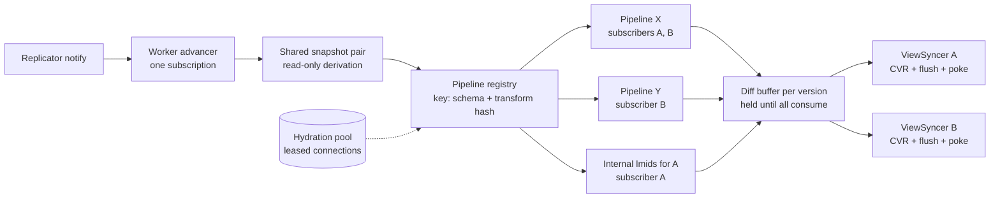

# 004: Cross-client-group query dedupe

- **Status:** Proposed
- **Date:** 2026-09-22
- **Packages:** `zero-cache` (view-syncer, pipeline-driver, snapshotter, cvr,
  workers/syncer), `zqlite` (table-source)
- **Builds on:** the shared-advance eligibility telemetry (#6252), the
  worker-wide snapshot row cache (#6624), the parked "SharedPipelines" design
  in #6233, the read-only IVM derivation on `mlaw/flow-control`, and
  [003: Per-pipeline reset](003_per_pipeline_reset.md)

## Summary

Every client group gets its own `ViewSyncerService`, and the service owns its
own `PipelineDriver`, `Snapshotter`, and IVM pipelines. When two client groups
run the same transformed query, both drivers scan the same change-log range
and push the same source changes through two identical operator graphs. The
work scales with the number of client groups, not with the number of distinct
queries.

Sharing pipelines across client groups on a sync worker is possible. The
isolation is six specific couplings inside the view-syncer, not one wall, and
three of them have already been loosened on main or on parked branches. The
dedup key is the client schema plus the transformation hash, which is the key
the telemetry on main already reports.

The scope is one sync worker. The gate is production dedup-factor data from
the telemetry in #6252, which is exactly what #6233 was parked on. The ceiling
is about 2x from sharing alone: sharing removes the per-group IVM advance but
not the per-group CVR flush, which was co-dominant on the investigation box.

## Problem

Per logical write, the view-syncer does the following for every affected
client group independently:

```text
re-read change-log from SQLite      one Snapshotter per group
scan the query's rows               one TableSource per group per table
advance IVM operators               one pipeline per group per query
flush the CVR to Postgres           one flush per group
poke connected clients
```

Total work is `O(writes × client groups × queries)`, serialized inside a sync
worker. The fan-out investigation on `origin/arv/rm-vs-fanout` measured this
on a 4-vCPU container with a workload where every client group runs the same
three queries over one hot org.

| Measurement                                        | Value    |
| -------------------------------------------------- | -------- |
| Advance of 32 identical writes, 1 pipeline driver  | 0.54 ms  |
| Advance of 32 identical writes, 50 pipeline drivers | 15.7 ms |
| Per-client-group IVM advance, saturated            | ~58 ms   |
| Per-client-group CVR flush to Postgres, saturated  | ~46 ms   |

The first two rows are `pipeline-driver-advance.bench.ts` on that branch. The
last two are the OTLP stage timings in its `findings.md`. Advance and flush
are the two co-dominant view-side costs. Sharing attacks the first.

## Prior art

Four pieces of this work exist. Two are on main, two are on branches that
never merged.

| Piece                              | Where                                                                                                        | Status         |
| ---------------------------------- | ------------------------------------------------------------------------------------------------------------ | -------------- |
| Shared-advance eligibility telemetry | #6252, commit `d6f881b1b`                                                                                  | On main        |
| Worker-wide snapshot row cache     | #6624, commit `ceac4a923`                                                                                    | On main        |
| SharedPipelines design, lever A1   | #6233 (closed), branch `origin/arv/rm-vs-fanout`, `apps/zero-throughput/reports/2026-07-rm-vs-fanout/design-10x.md` | Parked         |
| Read-only IVM derivation           | commit `433f8195f` on branch `mlaw/flow-control`                                                             | Not on main    |

**Telemetry (#6252).** `ViewSyncer.pipelineHashes()` and `clientSchemaKey`
feed `computePipelineDedupStats()` in `workers/syncer.ts`. It exports the
per-worker gauges `sync.pipelines_total` and `sync.pipelines_unique` and logs
`shared-advance-eligibility` every 5 minutes with the dedup factor and the top
10 duplicated pipelines. Internal queries (`lmids`, `mutationResults`) embed
the client group ID in their AST and are segmented out.

**Row cache (#6624).** `SnapshotRowCache` is created once per worker in
`server/syncer.ts` and handed to every `Snapshotter`. Every client group's
diff of the same change-log entry reads the row once. This is cross-group
sharing at the Snapshotter level without sharing pipelines.

**Parked design (#6233).** Lever A1 in `design-10x.md`: advance each unique
`(clientSchema, transformationHash)` once per worker and multicast the diff.
The branch also holds a multi-client-group test harness (`setupMultiCG`, with
the existing view-syncer pg suites refactored onto it) and the advance bench.
Neither landed.

**Read-only derivation (`433f8195f`).** `TableSource.#writeChange` runs real
`INSERT`, `DELETE`, and `UPDATE` statements into the view-syncer's
`BEGIN CONCURRENT` snapshot during advancement and relies on
`Snapshot.resetToHead()` to roll them back. That is why every client group
needs its own connection pair. The branch replaces the writes with an
in-memory per-table batch overlay behind a `deferIvmWrites` flag. The
Postgres view-syncer suites have not yet been run in deferred mode.

## Where the isolation lives

Six couplings inside the view-syncer and one outside it. Each row names the
code that enforces it today and what sharing needs instead.

| #   | Coupling                                 | Enforced today by                                                                                                                                                             | What sharing needs                                                                                                                                                                                       |
| --- | ---------------------------------------- | ----------------------------------------------------------------------------------------------------------------------------------------------------------------------------- | -------------------------------------------------------------------------------------------------------------------------------------------------------------------------------------------------------- |
| 1   | One snapshot pair per client group       | `Snapshotter` opens 2 SQLite connections per driver. `TableSource.#writeChange` applies changes into the prev snapshot. `addQuery` and `#advance` assert they never overlap. | One snapshot pair per worker, via read-only derivation. Hydration moves to leased connections, then replays the change log from its hydration version to the shared head before attaching.             |
| 2   | Pipelines keyed by the client's query ID | `PipelineDriver.#pipelines`, `RowChange.queryID`, and CVR `refCounts` keyed by query hash.                                                                                    | A registry keyed by `(clientSchemaKey, transformationHash)` whose entries hold subscribers as `(clientGroupID, queryID)` pairs. A multimap: two query IDs in one group can transform to the same AST.   |
| 3   | One output per pipeline                  | `input.setOutput` feeds one `Streamer.accumulate` call tagged with the query ID.                                                                                              | Fan out after the `Streamer` at the `RowChange` level, one batch per subscriber with its own query IDs substituted. No change inside the operator graph.                                                 |
| 4   | Advance loop and lock per view-syncer    | Each service gets its own `Subscription<ReplicaState>`. `#advancePipelines` does advance, CVR update, flush, and poke in one locked pass.                                    | A worker-level advancer with one subscription moves each unique pipeline to version V once. Each subscriber applies the diff to its CVR at V under its own lock. The diff for V is buffered until consumed. |
| 5   | Reset semantics per driver               | `ResetPipelinesSignal` tears down the whole driver. The advancement budget is the group's total hydration time. `#resetPipelinesIfBehindCVR` resets when a reloaded CVR is ahead. | Budget per shared pipeline, as in 003. A reset rehydrates once for all subscribers. The behind-CVR case parks the subscriber until the shared head reaches its CVR version, then joins it as a late joiner. |
| 6   | Late joiners hydrate from SQLite         | A group hydrates each query itself and reconciles against its CVR through `trackQueries`, `received`, and `deleteUnreferencedRows`.                                          | A joiner needs the pipeline's current footprint at its version: rows plus per-query occurrence counts, from a re-fetch of the top operator or a cache. Snapshot and subscribe are one atomic step, and the CVR reconciles through the same updater path. |
| 7   | Worker assignment by load                | `SyncerAssigner` picks the least-loaded worker with a hash tie-break. Queries are unknown at connect time.                                                                    | Nothing for a first cut. Dedup is per sync worker. Cross-worker sharing means a separate pipeline tier with diffs over IPC.                                                                              |

Coupling 4 is where advance dedup comes from. Coupling 6 is where hydration
dedup comes from. Couplings 2 and 3 are plumbing. Couplings 1 and 5 are the
correctness work.

Two of the seven are partly done: coupling 1 by the read-only derivation
branch, and coupling 5 by 003, which moves the reset budget from the group to
the pipeline for reasons of its own.

## Goals and non-goals

Goals:

- Advance each unique `(clientSchemaKey, transformationHash)` pipeline once
  per sync worker per replica version, and deliver the resulting row changes
  to every subscribing client group's CVR.
- Scan the change log once per worker per version instead of once per client
  group.
- Let a client group whose query already runs on the worker attach without a
  fresh SQLite hydration.
- No client or protocol change. Clients still receive per-group pokes at
  their own CVR versions.
- Ship in flagged steps, each measurable on the multi-client-group harness
  and the advance bench from #6233.

Non-goals:

- Cross-worker sharing. Client groups land on workers by load. A pipeline
  tier that ships diffs to sync workers over IPC is a different architecture.
- Sharing the CVR or the CVR flush. Each client group keeps its own rows,
  refcounts, and Postgres flush. Flush batching is lever A2 in #6233.
- Query containment. `query-covering.ts` shadow-logs when one query's rows
  are a superset of another's within a client group. That is a different
  form of dedup and stays separate.
- Changing the budget heuristics. They move to pipeline scope through 003.

## Design

### Shape on a worker

One advancer, one snapshot pair, one pipeline per unique transformed query.
View-syncers keep the CVR, flush, and poke, and subscribe to pipelines instead
of owning them.



Pipeline X advances once for A and B. Internal queries embed the client group
ID, so they sit in the same registry with one subscriber each. Nothing needs
to special-case them.

### The row-change envelope

The smallest concrete change is the tag on the row change:

```diff
 RowChange
-  queryID: string          client-chosen hash, one client group
+  pipelineKey: string      clientSchemaKey + transformationHash
   table, rowKey, row

+subscribers[pipelineKey] = [(clientGroupID, queryID), ...]
+  each subscriber's updater receives the batch with its own queryIDs
```

The fan-out lives after the `Streamer`, not inside the operator graph. The
IVM `FanOut` operator is for `OR` branches and is unrelated.

### The advance loop

```diff
-on version-ready notification            one Subscription per ViewSyncer
-  acquire this group's lock
-  diff = snapshotter.advance()
+on version-ready notification            one Subscription per worker
+  diff = sharedSnapshotter.advance()     one change-log scan per worker
   for each change in diff
     tableSource.push(change)
-    operators emit RowChange{queryID, row}
+    operators emit RowChange{pipelineKey, row}
+  for each subscriber (clientGroupID, queryID) of each touched pipeline
+    buffer[clientGroupID] += RowChange{queryID, row}
+  for each client group with a non-empty buffer
+    acquire that group's lock
     updater.received(rows)
     cvrStore.flush()
     poke clients
```

All subscribers of a pipeline are in version lockstep. The pipeline is at
exactly one version, so a subscriber that has not yet applied the diff for V
cannot be shown V+1. The diff for V is held per subscriber until that
subscriber's CVR update runs. A group whose CVR flush is slow holds a buffered
diff, not the pipeline.

### Subscribing and late joiners

```text
ViewSyncer C wants (key, queryID)
  if registry has key
    under the advancer's exclusion         no advance runs inside this block
      V = pipeline.version
      footprint = pipeline.footprint()     rows, versions, occurrence counts per query
      register C as PENDING at V           diffs after V are retained for C from here
    run C's group pass at V                group version barrier, below
      drain C's other subscriptions to V
      reconcile C's CVR against footprint  trackQueries, received, deleteUnreferencedRows
      flush once at V
    activate C                             C drains its retained diffs from V+1 on
    on failure: discard C's pending registration and retained diffs
  else
    lease a hydration connection at V0
    build and hydrate the pipeline
    replay change log V0..V on it alone    row cache makes this cheap
    register at V, then join as above
```

**The snapshot and the registration are one atomic step.** Reconciliation
awaits Postgres. If the advancer could reach V+1 between reading the
footprint at V and adding C as a subscriber, that diff would never be
retained for C and C would miss it permanently. So the footprint read and
the pending registration happen together under the same mutual exclusion
that today keeps `addQuery` and `#advance` apart. From that point every diff
after V is retained for C, and C drains the retained diffs when it activates.
A re-fetch of a live operator has the same requirement for a different
reason: an advance mid-traversal would corrupt operator state. The re-fetch
runs inside the exclusion, so the shared advance waits for it as it waits for
a hydration today.

**The footprint is rows with counts, not a set.** `Streamer.#streamNodes`
recurses into every relationship of every node, so a child row reached
through two parents is emitted twice for one query. `#processChanges`
increments `refCounts[queryID]` once per ADD, and `mergeRefCounts` sums. The
CVR therefore holds that child at count 2, and removing one parent later
brings it to 1, not 0. A cache that stored unique rows would initialize the
count to 1, and the first parent removal would delete the child from the
client. The footprint is defined as, for each row, its version and its
occurrence count per query, including related rows. A re-fetch of the top
operator through the `Streamer` produces exactly that. A cached footprint has
to store it.

The reconcile step is the existing `CVRQueryDrivenUpdater` path. It already
takes a full row stream for an executed query and computes the puts, deletes,
and refcount changes against whatever the CVR currently holds. Feeding it the
footprint instead of a fresh hydration is the change on the CVR side. The
ordering around it is the barrier below.

Hydration on a leased connection is the part that does not exist today. The
driver asserts that hydration and advancement never overlap because both use
the same snapshot. With one shared snapshot per worker, a hydration for any
group would stall every group's advance. The pool decouples them: hydrate at
whatever version the leased connection sees, then catch that one pipeline up
to the shared head by replaying the change log through it alone, exactly as
`#advance` does today for a whole driver.

### Group version barrier

A client group's CVR has one version. `CVRQueryDrivenUpdater` takes a single
`stateVersion` in its constructor and moves the whole CVR to it. Suppose a
slow group holds a retained diff for query A at V-1 and attaches query B at
the shared head V. Reconciling B alone would flush the CVR at V while A's
rows are still at V-1, and clients would receive cookie V for a view that is
not consistent at V. The group lock serializes the writes but does not fix
the order.

The rule: all of a group's CVR work is a sequence of locked passes, each at
one version, and each pass applies everything the group has through that
version before it flushes.

```text
group pass at V
  for each active subscription: apply retained diffs through V
  for each pending join pinned at V: reconcile against its footprint at V
  for each removal or retransform pinned at V: removeTrackedQueries, drop its diffs
  flush once at V; poke
```

Joins, removals, and retransforms are enqueued as operations pinned at a
version and ordered against the retained diffs in that queue. A join pinned
at V cannot run in a pass below V, and a pass at V cannot run until the
group's retained diffs reach V. A retransform is a removal of the old
pipeline key plus a join of the new one, pinned at the same version. Retained
diffs for a removed query are discarded, since `removeTrackedQueries` already
produces the deletes.

### Resets

003 moves the advancement budget from the group to the pipeline and lets the
driver drop one pipeline, finish the advancement, and rebuild the dropped one
in the same poke. Under sharing that is the right shape already: a pipeline
over budget is dropped and rebuilt once, and every subscriber's CVR receives
the rebuilt row set through the late-track primitive from 003 Part B.

Whole-driver resets remain for schema changes, truncation, and permission
changes. Under sharing they rehydrate each unique pipeline once instead of
once per group, which makes a reset storm like the one in 003 cheaper by the
dedup factor.

`#resetPipelinesIfBehindCVR` handles a CVR reloaded ahead of the pipelines:
another instance flushed the group at a version this worker's replica has
not reached. The shared pipeline's footprint is then older than the CVR, and
reconciling against it would move the CVR backwards. The updater forbids
this: its constructor asserts `stateVersion >= cvr.version.stateVersion`,
and that assertion stays. Under sharing this case is a quarantine, not a
reconcile. The subscriber is parked with no updater constructed until the
shared head reaches at least its CVR version, and then it joins as a late
joiner at that head with its boundary established there. That is what
`#maybeHydratePipelines` does today when it returns early on a replica
behind the CVR, minus the teardown.

### What stays per client group

- The CVR: queries, desires, rows, refcounts, and versions.
- Clients, pokers, and catchup of clients behind the CVR.
- The TTL clock, expiry, hydration budget, and circuit breaker. These are
  policy and stay where the client group is.
- Connection contexts and the custom-query transform round trip. The
  transform is per user. Its output hash is the dedup key, so that seam is
  already in the right place.
- Operator storage. `ClientGroupStorage` is keyed by client group ID in the
  storage SQLite file; it becomes keyed by pipeline key. Trivial.

## Risks

- **The dedup factor is workload dependent.** `transformAndHashQuery` binds
  auth data into the AST as literals and adds permission rules before
  hashing, and custom-query transforms usually inject the user. A query
  filtered by user never dedups across users, only across one user's tabs,
  devices, and reconnects. Public and org-wide queries dedup fully. The
  `shared-advance-eligibility` log answers this per worker for real
  workloads. Read it before building step 3 below.

- **Sharing does not touch CVR flush.** Each client group still writes its
  own row records to Postgres. Flush was co-dominant with advance on the
  investigation box, so pipeline sharing alone caps near 2x. Lever A2 in
  #6233 is the other half.

- **Scope is one sync worker.** The whole-process dedup factor is the
  per-worker factor at best, and the number of workers is usually the core
  count.

- **Version lockstep is new.** Today a slow client group only delays itself.
  Under sharing a subscriber that has not consumed the diff for V holds that
  diff in memory. The buffer needs a bound and a policy for what happens when
  it is hit. Stalling the pipeline on the slowest subscriber reproduces the
  slow-subscriber collapse the fan-out investigation measured on the
  replication side.

- **Join boundary races.** The footprint read and the pending registration
  must be one step under the advancer's exclusion, and the group pass that
  reconciles the join must not run below the join's pinned version. Either
  gap loses a diff for the joiner, and the loss is silent until a client
  shows a stale row. The two tests under Testing exist for these two gaps.

- **Refcount errors.** Three ways to get the CVR's per-query counts wrong.
  A cached footprint that stores unique rows instead of occurrence counts
  under-counts a child reached through two parents. Two query IDs in one
  client group that share a transformation hash must each get their count
  bumped from one pipeline's output. Retained diffs applied in the wrong
  order relative to a join double-count or skip. The failure mode in every
  case is a row the client never deletes, or deletes early. The Postgres
  tests should compare exact counts against the pipeline's output, not the
  set of rows with a positive count.

- **Read-only derivation is unproven under the pg suites.** The conflict
  probe in `Snapshotter`'s `Diff` reads the prev connection that
  `TableSource` used to scribble into, and the branch has a reconcile step
  for that. The Postgres view-syncer tests have not been run in deferred
  mode.

## Sequencing

Four steps, each behind its own flag, each shippable and measurable on its
own. The multi-client-group harness and advance bench from #6233 should land
with step 2.

| Step | Change                                                                                                                                                  | Prerequisite                                        | Removes                                                                                          | Flag                     |
| ---- | ------------------------------------------------------------------------------------------------------------------------------------------------------- | --------------------------------------------------- | ------------------------------------------------------------------------------------------------ | ------------------------ |
| 1    | Land read-only IVM derivation from `mlaw/flow-control`.                                                                                                 | Run the pg view-syncer suites in deferred mode.     | Nothing yet. Enables step 2.                                                                     | `deferIvmWrites`, exists |
| 2    | Shared snapshot pair and one advance pass per worker. All drivers advance on the same diff. Hydration moves to leased connections and replays to head. | Step 1.                                             | One change-log scan per version instead of one per group. Two SQLite connections per worker.    | new                      |
| 3    | Pipeline registry keyed by `(clientSchemaKey, transformationHash)` with refcounted subscribers and a bounded per-subscriber diff buffer.                 | Step 2. A week of `shared-advance-eligibility` data. | The per-group IVM advance for every duplicated pipeline. This is the measured 1-versus-50 win.    | new                      |
| 4    | Cached footprint for late joiners. A group whose query already runs reconciles its CVR against the pipeline's footprint, rows with occurrence counts, instead of hydrating. | Step 3.                                             | Duplicate hydrations on reconnect and on new tabs.                                               | new                      |

Step 2 is worth shipping alone. It removes duplicated change-log scans
without changing any CVR semantics, and it forces the hydration-versus-advance
concurrency work that step 3 needs anyway.

Before starting step 3, read the `shared-advance-eligibility` log on a
production worker for a week. If the client dedup factor is near 1, stop after
step 2.

## Testing

- Step 1: the existing `zqlite-zql-test` suite already runs twice, once per
  write mode. Add a deferred-mode run of the Postgres view-syncer suites.
- Step 2: the multi-client-group harness from #6233, with an assertion that
  the change log is scanned once per version regardless of group count. The
  advance bench, 1 versus 50 drivers, should be flat in step 2 for the
  scan portion and flat overall after step 3.
- Step 3: for every subscriber after each advance, the refcount of its query
  on every row equals the occurrence count in the shared pipeline's output.
  Exact counts, not the set of rows with a positive count. Cover the multimap
  case with two query IDs in one group sharing a hash.
- Step 3, join boundary: suspend a group's reconciliation on its Postgres
  await, advance the shared pipeline past the join version, then resume. The
  joiner must receive the retained diff after activation, and the assertion
  is on exact counts at the new version.
- Step 3, group barrier: a group with query A retained at V-1 attaches
  query B at V. The flush that lands B is at V and contains A's diff for V.
  Clients receive one poke at V, never a cookie V with A at V-1.
- Step 3, behind-CVR: reload a CVR flushed at a version ahead of the local
  replica. No updater is constructed, the subscriber is parked, and it joins
  once the shared head reaches the CVR version.
- Step 4: a joiner whose CVR is at V-k for small k receives exactly the
  puts and deletes a fresh hydration would have produced, and never sees a
  row at a version older than V. Then, with a child row reachable through
  two parents, remove one parent: the child stays with count 1. A footprint
  that stored unique rows fails this test.

## Open questions

- **Buffer or backpressure.** When a subscriber falls behind on consuming
  diffs: keep buffering, evict the subscriber to a catchup path, or stall the
  pipeline?
- **Footprint memory.** A materialized footprint per unique pipeline stores
  rows, versions, and per-query occurrence counts, so it costs result size
  times unique pipelines. Re-fetching the top operator costs SQLite reads per
  joiner and holds the shared advance for the traversal. Which one, or a
  size threshold that picks.
- **Retention bound for pending joiners.** A join whose reconciliation is
  slow retains every diff after its version. This is the same buffer as the
  slow-subscriber case, with the same bound-and-policy question.
- **Hydration concurrency.** How many leased hydration connections per
  worker, and whether a hydration in progress delays the shared advance or
  runs fully off the advance path with a replay at the end.
- **Row-set signature and Cap drift.** The signature is per query today. Per
  shared pipeline it is one value written into each subscriber's query
  record. Confirm the drift bump still reaches every subscriber's CVR
  version.
- **Cross-worker.** If the per-worker dedup factor is high but the worker
  count is also high, revisit a pipeline tier that ships diffs to sync
  workers over IPC.
