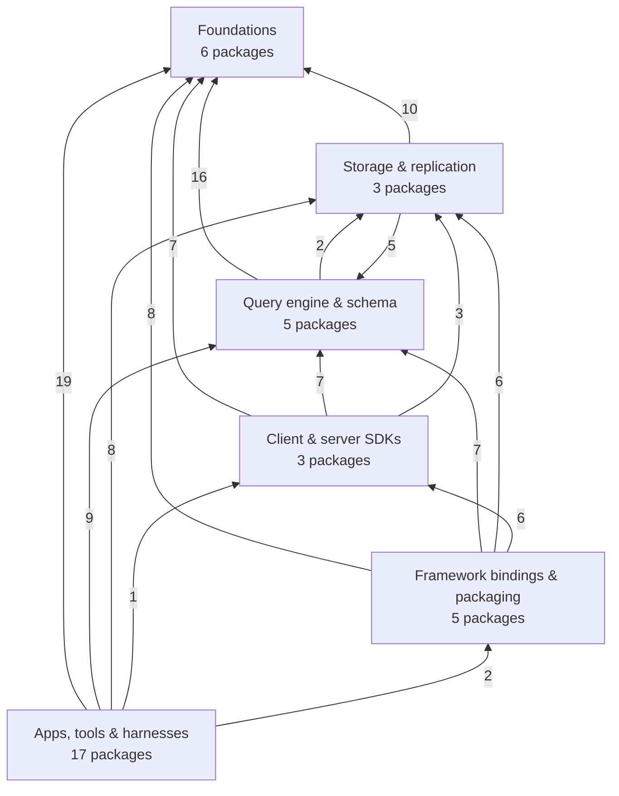

<!-- Generated by `pnpm graph`; do not edit by hand. -->

# Package dependency map

This view comes from pnpm workspace membership plus the curated architectural
layers in `tools/package-graph/src/workspace.ts`. Arrows point from a consumer to the internal
package it depends on. External npm packages are omitted; internal devDependencies are not.

Packages in this repo import each other as TypeScript source over relative paths,
so an internal dependency is usually declared as a **devDependency** — 117
of the 133 edges below. Those are the architecture here, not
test scaffolding, so they are drawn like any other edge;
`tools/verify-package-deps` is what keeps the manifests honest against the
actual imports.

**39 workspace packages · 133 direct internal dependencies · 44 structural edges**

## Bird's-eye view

The number on an arrow is the count of direct package dependencies crossing
those two layers.



## Layer inversions

Layers run low to high and arrows point consumer → dependency, so a dependency
that climbs to a **higher** layer is a package reaching into something meant to
sit above it. These are reported, not forbidden — but each one should be a
deliberate decision, and a new row here is worth a question in review.

| Consumer | Its layer | Depends on | Which sits in | Declared as |
| --- | --- | --- | --- | --- |
| `ast-to-zql` | Query engine & schema | `zero-cache` | Storage & replication | dev |
| `z2s` | Query engine & schema | `zero-cache` | Storage & replication | dev |

## Package paths

This diagram uses the graph's transitive reduction so the architectural paths
remain legible. For example, when `A → B → C` exists, a direct `A → C`
shortcut is left out here. The inventory below retains every direct dependency
declared in package.json.

```mermaid
flowchart BT
  subgraph layer_foundations["Foundations"]
    pkg__rocicorp_zero_events["@rocicorp/zero-events"]
    pkg_datadog["datadog"]
    pkg_otel["otel"]
    pkg_shared["shared"]
    pkg_zero_protocol["zero-protocol"]
    pkg_zero_types["zero-types"]
  end

  subgraph layer_query_engine["Query engine &amp; schema"]
    pkg_ast_to_zql["ast-to-zql"]
    pkg_z2s["z2s"]
    pkg_zero_permissions["zero-permissions"]
    pkg_zero_schema["zero-schema"]
    pkg_zql["zql"]
  end

  subgraph layer_storage["Storage &amp; replication"]
    pkg_replicache["replicache"]
    pkg_zero_cache["zero-cache"]
    pkg_zqlite["zqlite"]
  end

  subgraph layer_sdks["Client &amp; server SDKs"]
    pkg_zero_client["zero-client"]
    pkg_zero_pg["zero-pg"]
    pkg_zero_server["zero-server"]
  end

  subgraph layer_bindings["Framework bindings &amp; packaging"]
    pkg__rocicorp_zero["@rocicorp/zero"]
    pkg_analyze_query["analyze-query"]
    pkg_zero_react["zero-react"]
    pkg_zero_react_native["zero-react-native"]
    pkg_zero_solid["zero-solid"]
  end

  subgraph layer_apps_tools["Apps, tools &amp; harnesses"]
    pkg_client_simulator["client-simulator"]
    pkg_load_generator["load-generator"]
    pkg_otel_proxy["otel-proxy"]
    pkg_package_graph["package-graph"]
    pkg_process_tracker["process-tracker"]
    pkg_replicache_doc["replicache-doc"]
    pkg_replicache_perf["replicache-perf"]
    pkg_scripts["scripts"]
    pkg_sqlite_io_yield_simulator["sqlite-io-yield-simulator"]
    pkg_verify_package_deps["verify-package-deps"]
    pkg_zbugs["zbugs"]
    pkg_zero_sst["zero-sst"]
    pkg_zero_throughput["zero-throughput"]
    pkg_zql_benchmarks["zql-benchmarks"]
    pkg_zql_integration_tests["zql-integration-tests"]
    pkg_zql_viz["zql-viz"]
    pkg_zqlite_zql_test["zqlite-zql-test"]
  end

  pkg__rocicorp_zero --> pkg_analyze_query
  pkg__rocicorp_zero --> pkg_zero_pg
  pkg__rocicorp_zero --> pkg_zero_react
  pkg__rocicorp_zero --> pkg_zero_solid
  pkg__rocicorp_zero_events --> pkg_shared
  pkg_analyze_query --> pkg_zero_client
  pkg_ast_to_zql --> pkg_zero_cache
  pkg_client_simulator --> pkg_zero_protocol
  pkg_datadog --> pkg_shared
  pkg_load_generator --> pkg_shared
  pkg_otel --> pkg_shared
  pkg_process_tracker --> pkg_shared
  pkg_replicache --> pkg_shared
  pkg_replicache_doc --> pkg_replicache
  pkg_replicache_perf --> pkg_replicache
  pkg_sqlite_io_yield_simulator --> pkg_zqlite
  pkg_z2s --> pkg_zero_cache
  pkg_zbugs --> pkg__rocicorp_zero
  pkg_zero_cache --> pkg__rocicorp_zero_events
  pkg_zero_cache --> pkg_zero_permissions
  pkg_zero_cache --> pkg_zqlite
  pkg_zero_client --> pkg_ast_to_zql
  pkg_zero_client --> pkg_datadog
  pkg_zero_client --> pkg_replicache
  pkg_zero_permissions --> pkg_zero_schema
  pkg_zero_permissions --> pkg_zql
  pkg_zero_pg --> pkg_zero_server
  pkg_zero_protocol --> pkg_zero_types
  pkg_zero_react --> pkg_zero_client
  pkg_zero_react_native --> pkg_replicache
  pkg_zero_schema --> pkg_zero_protocol
  pkg_zero_server --> pkg_z2s
  pkg_zero_solid --> pkg_zero_client
  pkg_zero_throughput --> pkg__rocicorp_zero
  pkg_zero_types --> pkg_shared
  pkg_zql --> pkg_otel
  pkg_zql --> pkg_zero_protocol
  pkg_zql_benchmarks --> pkg_zql_integration_tests
  pkg_zql_integration_tests --> pkg_ast_to_zql
  pkg_zql_integration_tests --> pkg_zero_server
  pkg_zql_viz --> pkg_zql
  pkg_zqlite --> pkg_zero_schema
  pkg_zqlite --> pkg_zql
  pkg_zqlite_zql_test --> pkg_zqlite
```



## Direct dependency inventory

| Layer | Package | Kind | Direct workspace dependencies |
| --- | --- | --- | --- |
| Foundations | [`@rocicorp/zero-events`](../packages/zero-events) | published package | `shared` _(dev)_ |
| Foundations | [`datadog`](../packages/datadog) | internal package | `shared` _(dev)_ |
| Foundations | [`otel`](../packages/otel) | internal package | `shared` _(dev)_ |
| Foundations | [`shared`](../packages/shared) | internal package | — |
| Foundations | [`zero-protocol`](../packages/zero-protocol) | internal package | `shared` _(dev)_, `zero-types` _(dev)_ |
| Foundations | [`zero-types`](../packages/zero-types) | internal package | `shared` _(dev)_ |
| Query engine & schema | [`ast-to-zql`](../packages/ast-to-zql) | internal package | `shared` _(dev)_, `zero-cache` _(dev)_, `zero-protocol` _(dev)_, `zero-schema` _(dev)_, `zero-types` _(dev)_ |
| Query engine & schema | [`z2s`](../packages/z2s) | internal package | `shared` _(dev)_, `zero-cache` _(dev)_, `zero-protocol` _(dev)_, `zero-schema` _(dev)_, `zero-types` _(dev)_, `zql` _(dev)_ |
| Query engine & schema | [`zero-permissions`](../packages/zero-permissions) | internal package | `shared`, `zero-protocol`, `zero-schema`, `zero-types`, `zql` |
| Query engine & schema | [`zero-schema`](../packages/zero-schema) | internal package | `shared` _(dev)_, `zero-protocol` _(dev)_, `zero-types` _(dev)_ |
| Query engine & schema | [`zql`](../packages/zql) | internal package | `otel` _(dev)_, `shared` _(dev)_, `zero-protocol` _(dev)_, `zero-types` _(dev)_ |
| Storage & replication | [`replicache`](../packages/replicache) | published package | `shared` _(dev)_ |
| Storage & replication | [`zero-cache`](../packages/zero-cache) | internal package | `@rocicorp/zero-events` _(dev)_, `otel` _(dev)_, `shared` _(dev)_, `zero-permissions` _(dev)_, `zero-protocol`, `zero-schema` _(dev)_, `zero-types`, `zql`, `zqlite` |
| Storage & replication | [`zqlite`](../packages/zqlite) | internal package | `otel` _(dev)_, `shared` _(dev)_, `zero-protocol` _(dev)_, `zero-schema` _(dev)_, `zero-types` _(dev)_, `zql` |
| Client & server SDKs | [`zero-client`](../packages/zero-client) | internal package | `ast-to-zql` _(dev)_, `datadog` _(dev)_, `replicache` _(dev)_, `shared` _(dev)_, `zero-permissions` _(dev)_, `zero-protocol` _(dev)_, `zero-schema` _(dev)_, `zero-types` _(dev)_, `zql` _(dev)_ |
| Client & server SDKs | [`zero-pg`](../packages/zero-pg) | internal package | `zero-cache` _(dev)_, `zero-server` _(dev)_ |
| Client & server SDKs | [`zero-server`](../packages/zero-server) | internal package | `shared` _(dev)_, `z2s` _(dev)_, `zero-cache` _(dev)_, `zero-protocol` _(dev)_, `zero-schema` _(dev)_, `zero-types` _(dev)_, `zql` _(dev)_ |
| Framework bindings & packaging | [`@rocicorp/zero`](../packages/zero) | published package | `analyze-query` _(dev)_, `ast-to-zql` _(dev)_, `replicache` _(dev)_, `shared` _(dev)_, `zero-cache` _(dev)_, `zero-client` _(dev)_, `zero-pg` _(dev)_, `zero-react` _(dev)_, `zero-server` _(dev)_, `zero-solid` _(dev)_, `zqlite` _(dev)_ |
| Framework bindings & packaging | [`analyze-query`](../packages/analyze-query) | internal package | `ast-to-zql` _(dev)_, `otel` _(dev)_, `shared` _(dev)_, `zero-cache` _(dev)_, `zero-client` _(dev)_, `zero-protocol` _(dev)_, `zero-schema` _(dev)_, `zero-types` _(dev)_, `zql` _(dev)_, `zqlite` _(dev)_ |
| Framework bindings & packaging | [`zero-react`](../packages/zero-react) | internal package | `shared` _(dev)_, `zero-client` _(dev)_, `zero-schema` _(dev)_, `zql` _(dev)_ |
| Framework bindings & packaging | [`zero-react-native`](../packages/zero-react-native) | internal package | `replicache` _(dev)_, `shared` _(dev)_ |
| Framework bindings & packaging | [`zero-solid`](../packages/zero-solid) | internal package | `shared` _(dev)_, `zero-client` _(dev)_, `zql` _(dev)_ |
| Apps, tools & harnesses | [`client-simulator`](../tools/client-simulator) | tool | `shared` _(dev)_, `zero-protocol` _(dev)_ |
| Apps, tools & harnesses | [`load-generator`](../tools/load-generator) | tool | `shared` _(dev)_ |
| Apps, tools & harnesses | [`otel-proxy`](../apps/otel-proxy) | app | — |
| Apps, tools & harnesses | [`package-graph`](../tools/package-graph) | tool | — |
| Apps, tools & harnesses | [`process-tracker`](../tools/process-tracker) | tool | `shared` _(dev)_ |
| Apps, tools & harnesses | [`replicache-doc`](../packages/replicache-doc) | internal package | `replicache` _(dev)_ |
| Apps, tools & harnesses | [`replicache-perf`](../packages/replicache-perf) | internal package | `replicache`, `shared` |
| Apps, tools & harnesses | [`scripts`](../scripts) | tool | — |
| Apps, tools & harnesses | [`sqlite-io-yield-simulator`](../tools/sqlite-io-yield-simulator) | tool | `shared` _(dev)_, `zqlite` |
| Apps, tools & harnesses | [`verify-package-deps`](../tools/verify-package-deps) | tool | — |
| Apps, tools & harnesses | [`zbugs`](../apps/zbugs) | app | `@rocicorp/zero`, `shared` _(dev)_ |
| Apps, tools & harnesses | [`zero-sst`](../prod/sst) | deployment | — |
| Apps, tools & harnesses | [`zero-throughput`](../apps/zero-throughput) | app | `@rocicorp/zero`, `shared` _(dev)_, `zero-protocol` _(dev)_, `zero-schema` _(dev)_, `zql` _(dev)_ |
| Apps, tools & harnesses | [`zql-benchmarks`](../packages/zql-benchmarks) | internal package | `otel` _(dev)_, `shared` _(dev)_, `zero-cache` _(dev)_, `zero-protocol` _(dev)_, `zero-schema` _(dev)_, `zero-types` _(dev)_, `zql` _(dev)_, `zql-integration-tests` _(dev)_, `zqlite` _(dev)_ |
| Apps, tools & harnesses | [`zql-integration-tests`](../packages/zql-integration-tests) | internal package | `ast-to-zql` _(dev)_, `otel` _(dev)_, `shared` _(dev)_, `z2s` _(dev)_, `zero-cache` _(dev)_, `zero-protocol` _(dev)_, `zero-schema` _(dev)_, `zero-server` _(dev)_, `zero-types` _(dev)_, `zql` _(dev)_, `zqlite` _(dev)_ |
| Apps, tools & harnesses | [`zql-viz`](../apps/zql-viz) | app | `zero-types` _(dev)_, `zql` _(dev)_ |
| Apps, tools & harnesses | [`zqlite-zql-test`](../packages/zqlite-zql-test) | internal package | `shared` _(dev)_, `zqlite` |

## Exported metrics

1 of these 39 packages exports an OpenTelemetry scrape, 162 series in all, read off the declaration sites in its source.

| Package | Series | Shape |
| --- | --- | --- |
| `zero-cache` | 162 | 73 counter, 45 gauge, 41 histogram, 3 updowncounter |

The names, types, units and descriptions are in [`docs/METRICS.md`](./METRICS.md), written by the same
`pnpm graph` run and gated by the same `--check`. The
interactive view renders them per package and in one sortable table, and
colouring by **Metric families** shows which packages export at all.

## Regenerate

From the repository root:

```sh
pnpm graph          # this file, plus the gitignored model + interactive view
pnpm graph:check    # fail if this file is stale
pnpm graph:open     # regenerate and open the interactive view
```

`pnpm graph` also writes two build products that are **not**
committed: `docs/graph/model.json` (the extracted workspace model — every renderer,
script, and agent query should read this rather than re-walking pnpm) and
`docs/graph/index.html` (an interactive view of the same model, with per-package
metrics, dependency/dependent cones, and layer filtering). It also writes the
committed [`docs/METRICS.md`](./METRICS.md).
