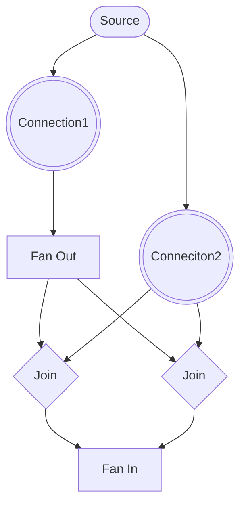

# Planner

SQLite plans single table queries. Our planner plans the joins.

Note: It may eventually plan single table queries as it becomes necessary on the frontend and/or we decide to replace SQLite with a different store.

## Architecture: Structure vs. Planning State

The planner uses a **dual-state design pattern** to separate concerns and enable fast planning:

### Graph Structure (Immutable)

Built once by `planner-builder.ts` and never modified during planning:

- **Nodes**: Sources, Connections, Joins, FanOut/FanIn, Terminus
- **Edges**: How nodes connect to each other (parent/child relationships)
- **Configuration**: Cost models, filters, orderings, constraints definitions

Think of this as the "blueprint" of the query - the structural relationships that don't change.

### Planning State (Mutable)

Modified during `PlannerGraph.plan()` as we search for the optimal execution plan:

- **Pinned flags**: Which connections have been locked into the plan
- **Join types**: Whether joins are 'left' (original) or 'flipped' (reversed)
- **Accumulated constraints**: What constraints have propagated from parent joins

Think of this as the "current attempt" - the state that changes as we explore different plans.

### Why This Separation?

1. **Performance**: Mutating state in-place is much faster than copying entire graph structures
2. **Multi-start search**: Can `resetPlanningState()` and try different starting connections
3. **Backtracking**: Can `capturePlanningSnapshot()` and `restorePlanningSnapshot()` when attempts fail
4. **Clarity**: Makes it obvious what changes during planning vs. what's fixed structure

This pattern is common in query optimizers (see Postgres, Apache Calcite, etc.) where the search space is large and performance matters.

## Graph

The planner creates a graph that represents the pipeline. This graph consists only of nodes that are relevant to planning joins:

1. Source
2. Connection
3. Fan-Out
4. Fan-In
5. Join

**Example graph:**

```ts
issue
  .where(
    ({or, exists}) => or(
      exists('parent_issue', q => q.where('id', ?)),
      exists('parent_issue', q => q.where('id', ?)),
    )
  )
```



## Plan Shape

```ts
// planner-builder.ts
export type Plans = {
  plan: PlannerGraph;
  subPlans: {[key: string]: Plans};
};
```

Because a query can be composed of sub-queries, a query plan can be composed of sub-plans. Concretely, `related` calls get their own query plans.

```ts
issue
  .related('owner', q => ...)
  .related('comments', q => ...);
```

The above query would result in a plan that is composed of 3 plans:

- Plan for the top level issue query
- Plan for the nested owner query
- Plan for the nested comments query

If there is more nesting, or more sibling related calls, there are more plans. There is a tree of plans.

`exists` calls do not create separate plans. All `exists` are planned together (that's the whole point of the planner!) as `exists` are inner & semi-joins so they are what need planning.

```ts
issue
  .exists('owner', q => ...)
  .exists('comments', q => ...)
```

The above query would result in a single plan that is not composed of any other plans. This is also the case if more exists were present.

## Degrees of Freedom

The planner can adjust two sets of knobs when creating a plan:

1. The flipping, or not, of joins
2. The ordering of `AND` conditions

The planner currently only leverages (1).

## Join Flipping

The planner creates a graph of the query as the query is written (i.e., ordering of logical terms is not changed). It then loops through a few steps:

1. Connection cost estimation
2. Connection selection
3. Join flipping & pinning
4. Constraint propagation
5. Connection pinning

until all connections have been selected or pinned.

## Cost Estimation

The cost of a connection is the estimated number of rows that will be scanned by that connections as well as any additional post-processing run against the connection to return those rows.

Examples:

```sql
SELECT * FROM issue;
```

The cost of the above would be the size of the issue table.

```sql
SELECT * FROM issue WHERE creator_id = ?;
```

The cost of the above would be the average number of rows per creator.

```sql
SELECT * FROM issue ORDER BY unindexed_column;
```

The cost of the above would be the size of the issue table + the cost to create a temp b-tree that contains all rows. This is one of those post processing steps referred to earlier.

`planner-connection.ts` takes a function that can return a cost, allowing different cost models to be applied. E.g., SQLite's or our own.

Limits are never provided to the cost estimator as we can never know how many rows will be filtered out before fulfilling a limit.

## Connection Selection

The lowest cost N connections are chosen as starting points for the planning algorithm. Each one will generate a unique plan and the plan with the lowest total cost will be the one selected.

## Join flipping & pinning

Once a connection is selected, we follow its outputs to the first join. That join, and all joins it outputs to, is the pinned.

`source -> connection1 -> join1 -> join2 <- connection2`

When "connection1" is chosen, both `join1` and `join2` will become pinned. This is because flipping any join on the path to the connection would cause that connection to no longer be run in the chosen position.
In other words, if a later step flips `join2` then `connection2` would become the outer loop to `connection1`, invalidating our plan that put `connection` in the outer loop.

If `connection1` was the child input to `join1` then `join1` is flipped. We follow `join1`'s output and apply the same logic:

- if `join1` is the child input of `join2`, flip and pin `join2` otherwise only pin `join2`.

## Constraint Propagation

After flipping and pinning, constraints are propagated up the graph from the final / "view" node.

node -propagate_constraints-> node -propagate_constraints-> node ...

- a pinned and not-flipped join will send constraints to its child
- a pinned and not-flipped join will forward constraints it received to its parent
- a pinned and flipped join will send undefined constraints to its child
- a pinned and flipped join will send a merger of constraints to its parent
- a non-pinned and non-flipped join will forward constraints to its parent
- a not pinned and flipped join is an error

See `planner-join.ts` for more detail.

## Connection Pinning

If a pinned join feeds a constraint directly to an unpinned connection, that connection becomes pinned. This is because that connection's order in the plan has becomed fixed by the pinning of the join feeding it.

```
c1 --> join
c2 --/
```

If `c1` is chosen, pinning join, then `c2` must go next.

```
c1  c2  c3
 |  |   |
 \  /   |
 join   |
   |    |
    \  /
    join
```

If `c1` is chosen, both joins are pinned. Since both joins are pinned, no more choices are available to the planner. Both `c2` and `c3` become pinned.

## Repeat: Cost Estimation

Once constraints have been propagated to connections, they can update their costs. In simple terms: selecting a join to put in the outer loop reveals constraints that will be available to later joins.
Costs are updated to reflect the new constraints.

---

We do not support flipping `not exists` so exists within a `not` are not allowed to be flipped.

- not exists will be considered non-flippable. So its child inputs will be considered non-selectable? Its a sub-tree tho...
