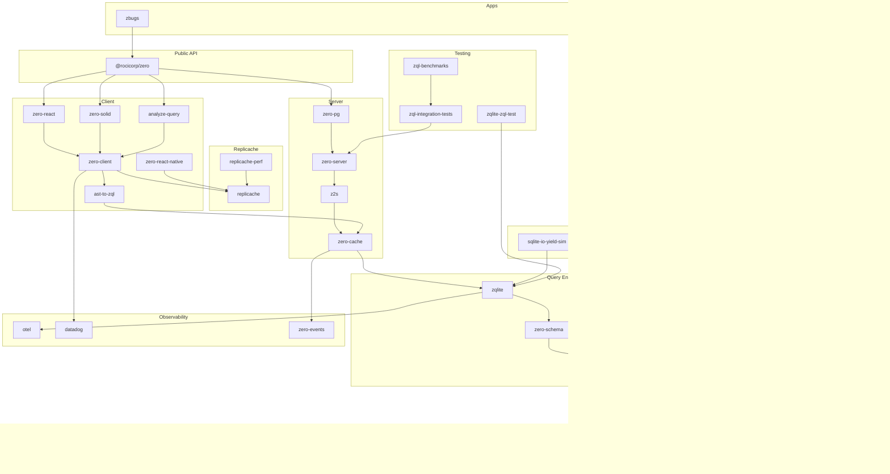

# Workspace Dependencies

Edges show only **direct non-redundant dependencies** (transitive reduction).
An edge A → B is omitted if B is already reachable via another of A's direct deps.

```mermaid
graph TD
    subgraph foundation["Foundation"]
        ztypes["zero-types"]
        zprot["zero-protocol"]
    end

    subgraph query["Query Engine"]
        zql
        zschema["zero-schema"]
        zqlite
    end

    subgraph observability["Observability"]
        otel
        datadog
        zevents["zero-events"]
    end

    subgraph repli["Replicache"]
        replicache
        repli_perf["replicache-perf"]
    end

    subgraph server["Server"]
        zcache["zero-cache"]
        z2s
        zserver["zero-server"]
        zpg["zero-pg"]
    end

    subgraph clientpkg["Client"]
        ast2zql["ast-to-zql"]
        zclient["zero-client"]

        zreact["zero-react"]
        zrn["zero-react-native"]
        zsolid["zero-solid"]
        aq["analyze-query"]
    end

    subgraph pubapi["Public API"]
        zeropkg["@rocicorp/zero"]
    end

    subgraph apps["Apps"]
        zbugs
        zqlviz["zql-viz"]
        otelproxy["otel-proxy"]
    end

    subgraph tools["Tools"]
        csim["client-simulator"]
        loadgen["load-generator"]
        ptrace["process-tracker"]
        sqlio["sqlite-io-yield-sim"]
    end

    subgraph testing["Testing"]
        zqlit["zql-integration-tests"]
        zqlbench["zql-benchmarks"]
        zqlitetest["zqlite-zql-test"]
    end

    %% Foundation chain
    zprot --> ztypes
    zql --> zprot


    %% Query Engine
    zschema --> zql
    zqlite --> zschema & otel

    %% Replicache
    repli_perf --> replicache

    %% Server chain
    zcache --> zqlite & zevents
    z2s --> zcache
    zserver --> z2s
    zpg --> zserver

    %% Client
    ast2zql --> zcache
    zclient --> ast2zql & datadog & replicache
    zreact --> zclient
    zrn --> replicache
    zsolid --> zclient
    aq --> zclient

    %% Public API
    zeropkg --> aq & zpg & zreact & zsolid

    %% Apps
    zbugs --> zeropkg
    zqlviz --> zql

    %% Tools
    csim --> zprot
    sqlio --> zqlite

    %% Testing
    zqlit --> zserver
    zqlbench --> zqlit
    zqlitetest --> zqlite
```
